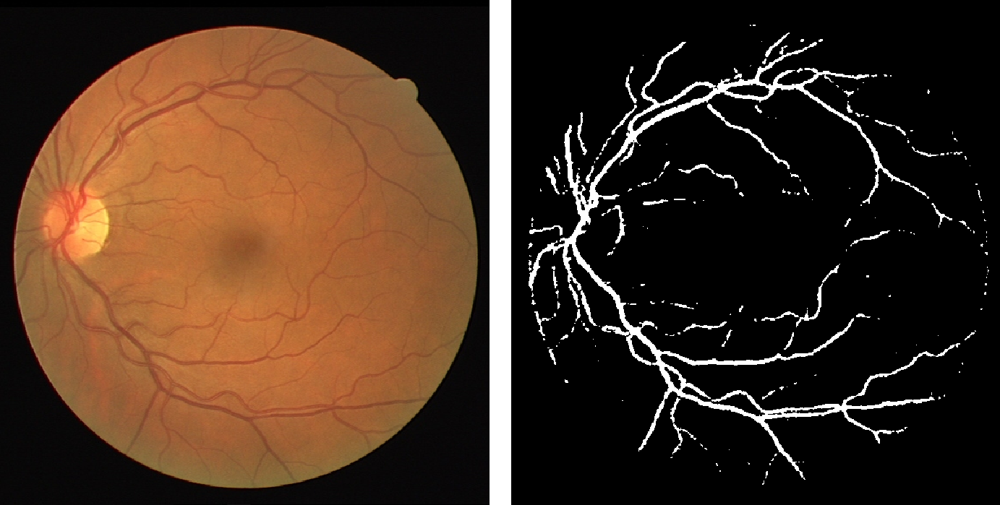

# Crawled Page: Build and test the container -
    
        Create your own algorithm -
    
    Grand Challenge
- **Source URL:** [https://grand-challenge.org/documentation/building-and-testing-the-container/](https://grand-challenge.org/documentation/building-and-testing-the-container/)

---

[←

Download example code](/documentation/download-example-code/)

[Deploy your algorithm

→](/documentation/add-the-algorithm/)

### Build and test the container[¶](#build-and-test-the-container "Permanent link")

Your algorithm container will process one job at a time, and each job will process only one set of inputs. So you need to write code that reads one set of inputs from a location in `/input` and writes your algorithm's outputs to a location in  `/output`. The [example code](/documentation/download-example-code/) provides a framework into which you can insert your algorithm code.

This will involve the following steps:

* [Run the test](#run-the-test)
* [Insert your code](#insert-your-code)
* [Update the Dockerfile](#update-the-dockerfile)
* [Update requirements.txt](#update-requirementstxt)

#### Reference Algorithm[¶](#reference-algorithm "Permanent link")

In this tutorial, we will build an algorithm image for a U-Net that segments retinal blood vessels from the [DRIVE Challenge](https://drive.grand-challenge.org/).   
Algorithm page: [Demo Vessel Segmentation](https://grand-challenge.org/algorithms/miriam-test/)  
Repository: [github.com/DIAGNijmegen/drive-vessels-unet/](https://github.com/DIAGNijmegen/drive-vessels-unet/)  
Demo algorithm image template: [github.com/DIAGNijmegen/demo-algorithm-template](https://github.com/DIAGNijmegen/demo-algorithm-template)

The image below shows an input image and the output of the algorithm. The algorithm takes a color fundus image (socket: color-fundus) together with the subjects age in months (socket: age-in-months) and produces a segmentation mask of the blood vessels (socket: binary-vessel-segmentation). You can find more information about the algorithm and its interfaces on the algorithm page: [Demo Vessel Segmentation](https://grand-challenge.org/algorithms/miriam-test/).



#### Template contents[¶](#template-contents "Permanent link")

The scripts for your container files were automatically generated by the platform. It includes bash scripts for building, testing, and saving the algorithm image. The contents for our demo algorithm are:

```
├── Dockerfile
├── README.md
├── do_build.sh
├── do_save.sh
├── do_test_run.sh
├── inference.py
├── requirements.txt
├── resources
│   └── some_resource.txt
└── test
    └── input
        ├── age-in-months.json
        └── images
            └── color-fundus
                └── 998dca01-2b74-4db5-802f-76ace545ec4b.mha
```

The helper scripts are:

* `do_test_run.sh`, which will test your container for debugging.
* `do_save.sh`, which will save your container to an image. Call this after a successful test run.
* `do_build.sh`, which is called by both other scripts to (re)build your container.

#### Run the test[¶](#run-the-test "Permanent link")

Before saving your container to an image—which will take some time and disk space—do a test run to see if your container successfully completes without errors.

There is a helper script for this which has the correct docker calls:

```
$ ./do_test_run.sh
```

This should output some basic docker build commands and all the stdout and stderr printing the template currently has. However, this only tests if the container runs without errors.

Remove the `--gpus=all` flag in the script if you don't have a GPU in your machine. This will not affect your exported container image.

Note that on the first run, the build process might take a while since it needs to download some large image layers. Subsequent rebuilds of your container should be much faster, since Docker will have stored the layers.

Test your container frequently during the next steps. This will help you determine what introduced an error if one occurs.

#### Expand the test[¶](#expand-the-test "Permanent link")

You can expand the test, for example to validate if your output is actually generated:

We create a Python script `test.py` that automatically tests the algorithm for our use case.

```
import subprocess
from pathlib import Path

OUTPUT_DIR = Path("test") / "output"

def test_do_test_run():

    # Step 1: Run the shell script using subprocess
    result = subprocess.run(["./do_test_run.sh"], capture_output=True, text=True)

    # Step 2: Check if the script executed successfully
    assert result.returncode == 0, f"Script failed with error: {result.stderr}"

    # Step:3 Verify the output got created
    expected_output = OUTPUT_DIR / "images" / "binary-vessel-segmentation" / "output.mha"
    assert expected_output.exists()
```

You can invoke the testing script by calling `python test.py` assuming you have `pytest` installed.

The script can be further extended to also look at the content of the output and verify if it, for instance, has the correct voxel value ranges.

#### Insert your code[¶](#insert-your-code "Permanent link")

The next step is to edit *inference.py*. This is the file where you will insert your algorithm's code. If you are editing a baseline algorithm you'll need to swap the baseline algorithm code with yours. In this case, we add code to the template.

In the *inference.py*, a function, `run()`, has been created for you, and it is instantiated and called with:

```
if __name__ == "__main__":
    raise SystemExit(run())
```

The default function `run()` generated by the platform does simple reading of the input and saving of the output. In between reading and writing, there is a clear point where we are to insert the reference algorithm:

```
def run():
    # Read the input
    input_color_fundus_image = load_image_file_as_array(
        location=INPUT_PATH / "images/color-fundus",
    )
    input_age_in_months = load_json_file(
         location=INPUT_PATH / "age-in-months.json",
    ) # Note: we'll be ignoring this input completely

    # Process the inputs: any way you'd like
    _show_torch_cuda_info()

    with open(RESOURCE_PATH / "some_resource.txt", "r") as f:
        print(f.read())

    # TODO: add your custom inference here

    # For now, let us make bogus predictions
    output_binary_vessel_segmentation = numpy.eye(4, 2)

    # Save your output
    write_array_as_image_file(
        location=OUTPUT_PATH / "images/binary-vessel-segmentation",
        array=output_binary_vessel_segmentation,
    )

    return 0
```

The reference algorithm is found in a similar file *[reference-algorithm/inference.py](https://github.com/DIAGNijmegen/drive-vessels-unet/blob/master/inference.py)*.

We'll copy over the relevant part, adding `import` at the top of our python script as needed. Including some pre and postprocessing of the images. First, we'll start with the torch device settings and initializing the model:

```
device = torch.device("cuda" if torch.cuda.is_available() else "cpu")

# Initialize MONAI UNet with updated arguments
model = monai.networks.nets.UNet(
    spatial_dims=2,
    in_channels=3,
    out_channels=1,
    channels=(16, 32, 64, 128, 256),
    strides=(2, 2, 2, 2),
    num_res_units=2,
).to(device)
```

Next, we'll load in the weights.

##### Load your model weights[¶](#load-your-model-weights "Permanent link")

Ensure that the model weights are available at runtime. You can either include them in the container image—in this case place them in the `resources/` folder—or you can [upload the model weights separately](/documentation/upload-the-model-weights-separately/)—in this case place them in the `model/` folder. If your model weights are stored in a `resources/` folder, they will be copied into the image. This is done via this line of the Dockerfile:

```
COPY --chown=user:user resources /opt/app/resources
```

If you choose to upload them separately, a line in `do_save.sh` will compress the contents of `model/` into a tarball for uploading.

For now, we'll be copying the `best_metric_model_segmentation2d_dict.pt` from our reference Algorithm into the `resources/` directory.

Of course, we'll still need to load the weights into our initialized model by adding the following line to *inference.py*:

```
model.load_state_dict(torch.load( RESOURCE_PATH / "best_metric_model_segmentation2d_dict.pt"))
```

##### 🛠️ Processing Input and Output[¶](#processing-input-and-output "Permanent link")

The input is already read, but generally, we need to convert or preprocess it for our algorithm. We're going to hide that with a `preprocess` function. The same holds for the output: we are already writing a numpy array to an image, but we might need to perform some thresholding after our forward pass. We'll do that with a `postprocess` function of our design. In *inference.py* we'll combine the processing with the forward pass:

```
input_tensor = preprocess(image=input_color_fundus_image, device=device)

# Do the forward pass
with torch.no_grad():
  out = model(input_tensor).squeeze().detach().cpu().numpy()

output_binary_vessel_segmentation = postprocess(image=out, shape=input_color_fundus_image.shape)
```

##### Combining everything[¶](#combining-everything "Permanent link")

Finally, we should end up with an updated *inference.py* that will look something like this:

```
def run():
    # Read the input
    input_color_fundus_image = load_image_file_as_array(
        location=INPUT_PATH / "images/color-fundus",
    )
    input_age_in_months = load_json_file(
         location=INPUT_PATH / "age-in-months.json",
    )

    device = torch.device("cuda" if torch.cuda.is_available() else "cpu")

    # Initialize MONAI UNet with updated arguments
    model = monai.networks.nets.UNet(
        spatial_dims=2,
        in_channels=3,
        out_channels=1,
        channels=(16, 32, 64, 128, 256),
        strides=(2, 2, 2, 2),
        num_res_units=2,
    ).to(device)

    model.load_state_dict(torch.load( RESOURCE_PATH / "best_metric_model_segmentation2d_dict.pth"))

    # Ensure model is in evaluation mode
    model.eval()

    input_tensor = preprocess(image=input_color_fundus_image, device=device)

    # Do the forward pass
    with torch.no_grad():
        out = model(input_tensor).squeeze().detach().cpu().numpy()

    output_binary_vessel_segmentation = postprocess(image=out, shape=input_color_fundus_image.shape)

    # Save your output
    write_array_as_image_file(
        location=OUTPUT_PATH / "images/binary-vessel-segmentation",
        array=output_binary_vessel_segmentation,
    )

    return 0

def preprocess(image, device):
    # Step 1: Convert the input numpy array to a PyTorch tensor with float data type
    input_tensor = torch.from_numpy(image).float()

    # Step 2: Rearrange dimensions from [height, width, channels] to [channels, height, width]
    input_tensor = input_tensor.permute(2, 0, 1)

    # Step 3: Add a batch dimension to make it [1, channels, height, width]
    input_tensor = input_tensor.unsqueeze(0)

    # Step 4: Move the tensor to the device (CPU or GPU)
    input_tensor = input_tensor.to(device)

    # Calculate padding
    height, width = image.shape[:2]
    pad_height = (16 - (height % 16)) % 16
    pad_width = (16 - (width % 16)) % 16

    # Apply padding equally on all sides
    padding = (pad_width // 2, pad_width - pad_width // 2, pad_height // 2, pad_height - pad_height // 2)

    return F.pad(input_tensor, padding)

def postprocess(image, shape):
    image = transform.resize(image, shape[:-1], order=3)
    image = (expit(image) > 0.80)
    return (image * 255).astype(np.uint8)
```

There are a few things we still need to do before we can run the algorithm image.

#### Update the Dockerfile[¶](#update-the-dockerfile "Permanent link")

Ensure that you import the right base image in your Dockerfile. For our U-Net, we will build our Docker with the [official PyTorch Docker](https://hub.docker.com/r/pytorch/pytorch) as the base image. This should take care of installing PyTorch with the necessary CUDA environments inside your Docker. If you're using TensorFlow, please build your Docker with the official base image from TensorFlow. You can browse through [Docker Hub](https://hub.docker.com/) to find your preferred base image. The base image can be specified in the first line of your Dockerfile:

```
FROM pytorch/pytorch
```

Here are some [best practices](https://docs.docker.com/develop/develop-images/dockerfile_best-practices/) for configuring your Dockerfile.

Note that your container will run [without internet access](/documentation/runtime-environment/#no-network-access). You must therefore ensure that all the files needed to run your scripts are included in the container. This can be configured in the Dockerfile using the COPY command. For example, this line puts `requirements.txt` in `/opt/app`.

```
COPY --chown=user:user requirements.txt /opt/app/
```

The `/tmp` directory will be completely empty at runtime. This is scratch space that you can use for transient files, and will usually have a fast NVMe device attached. Any files that you included in `/tmp` in your Dockerfile will not be present at runtime. It is best practice to add these somewhere else, for example in a subdirectory of `/opt`.

#### Update requirements.txt[¶](#update-requirementstxt "Permanent link")

Ensure that all of the dependencies with their versions are specified in **requirements.txt** as shown in the example below:

```
SimpleITK
numpy
monai==1.4.0
scikit-learn
scipy
scikit-image
```

Note that we haven't included `torch` as it comes with the PyTorch base image included in our Dockerfile in the previous step.

#### 🦾 Do a final test run[¶](#do-a-final-test-run "Permanent link")

Finally, we are near the end! Add a good example input image in the `test/input/color-fundus` and run the local test:

```
$ ./do_test_run.sh
```

This should create a local Docker image, spawn a container, and do a forward pass on the input image. If all goes well, it should output a binary segmentation to `test/output/images/binary-vessel-segmentation`.

Once you are happy things work locally, you are ready to [deploy your algorithm](/documentation/add-the-algorithm/).

[←

Download example code](/documentation/download-example-code/)

[Deploy your algorithm

→](/documentation/add-the-algorithm/)