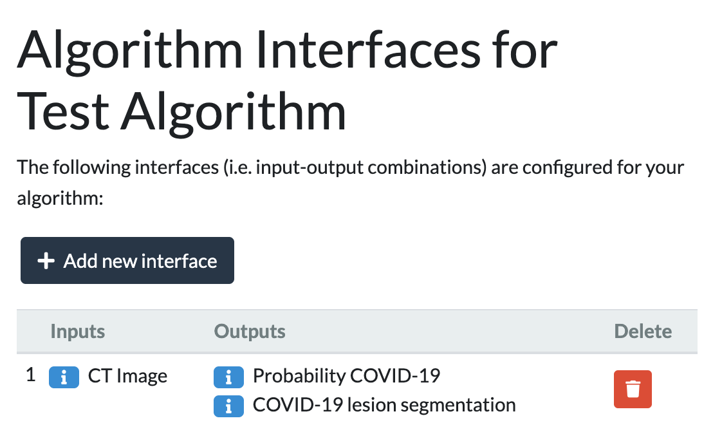
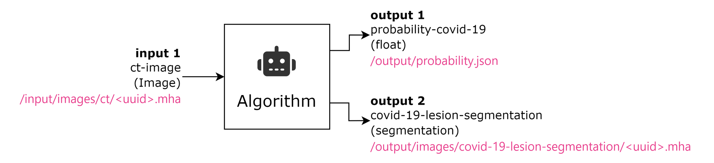
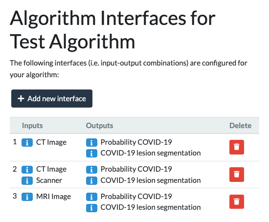
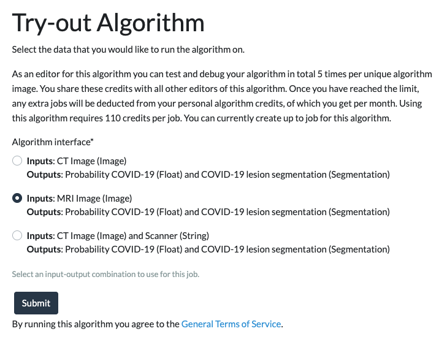

# Crawled Page: Define algorithm interfaces -
    
        Create your own algorithm -
    
    Grand Challenge
- **Source URL:** [https://grand-challenge.org/documentation/choose-input-and-output-interfaces/](https://grand-challenge.org/documentation/choose-input-and-output-interfaces/)

---

[←

Create an algorithm page](/documentation/create-an-algorithm-page/)

[Download example code

→](/documentation/download-example-code/)

### Define interfaces for your Algorithm[¶](#define-interfaces-for-your-algorithm "Permanent link")

If you are a participant in a challenge, you will not need to worry about defining interfaces for your algorithm. This is done by the challenge organizer, and your algorithm will automatically inherit the interfaces defined for the challenge phase when created.

Before you start developing your algorithm, you need to define the interface(s) that your algorithm works with. Without an interface, an algorithm cannot be used.

#### What are algorithm interfaces?[¶](#what-are-algorithm-interfaces "Permanent link")

An interface describes the inputs and outputs (so-called sockets) that your algorithm works with. An algorithm needs to have at least 1 interface, but can have as many interfaces as you want, more on the latter scenario later.

#### Input/output sockets[¶](#inputoutput-sockets "Permanent link")

An interface consists of at least 1 input socket and at least 1 output socket.
Sockets determine:

1. What kind of data we're dealing with: is it an image, a heatmap, a segmentation mask, a bounding box, etc.?
2. Where to read and write the data to and from. It determines the **path** to your data.

From the code base that you are preparing, a Docker image will be built that can be run as a Docker container. Every time it runs, it should process one set of inputs: it could be just one single image, but it could also be a combination of multiple images of the same patient, and perhaps some additional information such as age or sex.

If your algorithm takes multiple inputs, it needs to be able to differentiate between them and it needs to know where to read them from. This is where sockets come into play. Each input needs to have its own socket. They can be the same overarching type (e.g. all images, or all segmentations, etc.), but the sockets need to have a different name and point to a different file location. The same goes for outputs. So every input and every output has to have a **unique** socket. You cannot choose the same socket twice within an interface. Finally, the combination of input and output sockets is called an interface.

Let's look at a concrete example. Consider an algorithm that takes a CT image as input and outputs a segmentation and a probability estimate. To configure this algorithm's interface, go to the `Interfaces` tab of your algorithm, click on `Add new interface` and select the appropriate input and output sockets:



Inside a running container, an algorithm will take inputs from the `/input/` folder to process them and store the outputs in `/output/`. By choosing the sockets, you determine that the CT image needs to be read from `/input/images/ct/*random_uuid*.mha`, and that two outputs need to be written to `/output/images/covid-19-lesion-segmentation/*random_uuid*.mha` and `/output/probability.json`, respectively.

Thus for an algorithm with the following interface (i.e. input and output sockets):


The directory tree in your Docker container will have the following folder structure:

```
input/
├─ images/
│  ├─ ct/
│  │  ├─*random_uuid*.mha
output/
├─ images/
│  ├─ covid-19-lesion-segmentation/
│  │  ├─ *random_uuid*.mha
├─ probability.json
```

**NOTE:** Images require you to read and write randomly generated uuids, so hard-coding paths for these should be avoided. Rather, construct your read and write paths as such, following the above example:

```
import os

folderpath_read = r'input/images/ct/'
filename = os.listdir(folderpath_read)[0]  # pick the first (and only) file in folder
filepath_read = os.path.join(folderpath_read, filename)

folderpath_write = r'output/images/covid-19-lesion-segmentation/'
filepath_write = os.path.join(folderpath_write, filename)
```

Sockets can be chosen from a [list of existing sockets](/components/interfaces/algorithms/), or they can be requested. See the developer docs for an exhaustive [list](https://comic.github.io/grand-challenge.org/components.html#grandchallenge.components.models.InterfaceKind) of the types of inputs and outputs that are supported, and [instructions](https://comic.github.io/grand-challenge.org/_modules/grandchallenge/components/models.html#InterfaceKind.interface_type_json) on how to format JSON-serializable data such as bounding boxes and polygons.

As you may find, a lot of these sockets have very specific names, for particular tasks. But even though *“Probability COVID-19(Float)”* works as an interface for predicting anything that's expressed as a scalar value, we encourage you to request your own socket with a fitting name.

#### Requesting a new socket option[¶](#requesting-a-new-socket-option "Permanent link")

New sockets can be requested by emailing [support@grand-challenge.org](mailto:support@grand-challenge.org). In this email, please specify the following details for your socket:

1. Title
2. Short description (one or two sentences)
3. Kind of data
4. Suggestion for read/write path

Take inspiration from the [list of existing sockets](/components/interfaces/algorithms/), and use a similar style/format to specify the details mentioned above.
When the administrators of Grand-Challenge have added your sockets, they will appear in the list when you create a new algorithm interface.

#### The Case for Multiple Algorithm Interfaces[¶](#the-case-for-multiple-algorithm-interfaces "Permanent link")

An algorithm might be able to work with multiple different types of input, or might be able to generate meaningful predictions with only a subset of the inputs. For example, the above described algorithm might optionally use information about the scanner that the CT image was acquired with to fine-tune the segmentation process. Or, maybe the algorithm can also extract the Covid-19 lesions from an MRI image (not just the CT image).

The way to achieve this flexibility is to create multiple interfaces for your algorithm: one interface as shown above, one interface with an MRI input socket instead of the CT input slot, and a third interface with both the CT input socket as well as a scanner input socket.



Users that want to try out the algorithm can then choose which sets of inputs to provide to the algorithm by choosing the appropriate interface:



The algorithm container again gets the provided inputs at the locations defined by the various input sockets, and needs to first figure out which inputs were provided and then invoke the appropriate pipeline and produce the required outputs given the set of provided inputs. The latter also implies that the outputs can differ for different input combinations.

There are some restrictions you need to keep in mind when creating interfaces:

* The inputs and outputs of an interface need to be unique: you cannot have a CT image as both input and output, for example.
* The input combinations across all interfaces of an algorithm need to be unique: you cannot have 2 interfaces with the exact same input set (but differing outputs). Your algorithm needs to be able to deduce the required output(s) based on the input(s).
* You cannot edit interfaces, you can only add and delete interfaces, but these two actions should cover all use cases.

[←

Create an algorithm page](/documentation/create-an-algorithm-page/)

[Download example code

→](/documentation/download-example-code/)