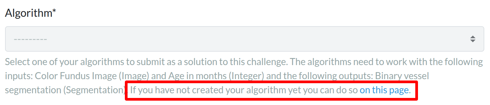
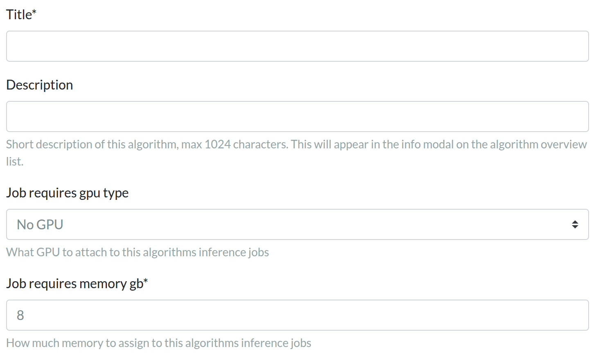

# Crawled Page: Create an algorithm page -
    
        Create your own algorithm -
    
    Grand Challenge
- **Source URL:** [https://grand-challenge.org/documentation/create-an-algorithm-page/](https://grand-challenge.org/documentation/create-an-algorithm-page/)

---

[←

Create your own algorithm](/documentation/create-your-own-algorithm/)

[Define algorithm interfaces

→](/documentation/choose-input-and-output-interfaces/)

### Create an algorithm page[¶](#create-an-algorithm-page "Permanent link")

How you create an algorithm on Grand Challenge depends on whether you are doing this as part of a challenge, or separately. Follow the specific instructions below.

* [Create an algorithm for a challenge](#create-an-algorithm-for-a-challenge)
* [Create an algorithm outside of a challenge](#create-an-algorithm-outside-of-a-challenge)

---

#### Create an algorithm for a challenge[¶](#create-an-algorithm-for-a-challenge "Permanent link")

Algorithms for challenges are created on the Submit page of the respective challenge. You will find a link to do so underneath the Algorithm drop-down:

Clicking on that link will open up a form where you get to give your algorithm a title and configure its resources (GPU type and memory):

Everything else is already configured for you (including the correct interfaces), so that your algorithm will work for the specific challenge phase.

---

#### Create an algorithm outside of a challenge[¶](#create-an-algorithm-outside-of-a-challenge "Permanent link")

To create an algorithm outside of a challenge on grand-challenge.org, click the button below and create your algorithm page. When you have access to this feature, you can also find this button on the algorithms page. Although free, we restrict access to this feature of Grand Challenge. If you wish to have access, please contact us at [support@grand-challenge.org](mailto:support@grand-challenge.org). Also see:  
[Do I need to pay to upload an algorithm and run it?](/documentation/faq-algorithms-costs-upload/)

[Add a new algorithm](/algorithms/create/)

Create the basic page by answering the questionnaire about your algorithm.

1. Prepare a Title and Logo
2. Choose CIRRUS Core as the default viewer
3. Set GPU and memory requirements correctly
4. Set hanging protocol and view content to control how the results will be displayed in the viewer, see [here](/documentation/how-to-configure-your-viewer/).

Once your algorithm is created, don't forget to configure the [interfaces (i.e., input-output combinations)](/documentation/choose-input-and-output-interfaces/).

[←

Create your own algorithm](/documentation/create-your-own-algorithm/)

[Define algorithm interfaces

→](/documentation/choose-input-and-output-interfaces/)