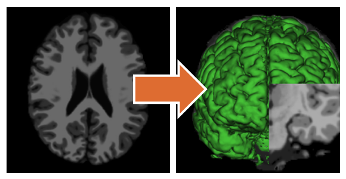

# Crawled Page: Document your algorithm -
    
        Create your own algorithm -
    
    Grand Challenge
- **Source URL:** [https://grand-challenge.org/documentation/documenting-your-algorithm-for-users/](https://grand-challenge.org/documentation/documenting-your-algorithm-for-users/)

---

[←

Try out your algorithm and publish a test case](/documentation/try-out-your-algorithm-and-publish-a-test-case/)

[Setting up Docker on Windows

→](/documentation/setting-up-wsl-with-gpu-support-for-windows-11/)

### How to document?[¶](#how-to-document "Permanent link")

Good documentation will ensure proper usage of your Algorithm. However, writing good documentation is hard. We make use of the Model Facts labels to split up the sections, making the task a bit easier. We describe each section below. We also created a [documentation example](#example) further down the page.

More information can be found in the Model Facts labels guidelines from Sendak, M.P., Gao, M., Brajer, N. et al. Presenting machine learning model information to clinical end users with model facts labels. npj Digit. Med. 3, 41 (2020). [10.1038/s41746-020-0253-3](https://doi.org/10.1038/s41746-020-0253-3).

When writing your documentation, consider who your audience is going to be. Will your algorithm be public or will you share it with specific individuals? When you have a broad audience, your documentation should be easy to comprehend. Also realize that users will not read your entire documentation. Therefore make it accessible by making important information easy to find.

  
*["T1 raw BLS"](https://www.slicer.org/wiki/File:T1_raw_BLS.png) and ["T1 tissues GM 3DRender BLS"](https://www.slicer.org/wiki/File:T1_tissues_GM_3DRender_BLS.png) from [slicer.org](https://www.slicer.org/wiki), both licensed under [CC BY-SA 4.0](https://creativecommons.org/licenses/by-sa/4.0/)"*

An image is worth a thousand words. An example of actual data input and output is worth even more. Hence we consider it best practice to [upload at least one test case and make it public](/documentation/try-out-your-algorithm-and-publish-a-test-case/#publish-a-test-case). This allows people to inspect the input data you have used and the output data your algorithm has produced.

##### Summary[¶](#summary "Permanent link")

Try to summarize what your model does in one sentence. You can additionally provide some minimal background information, such as why, when and by whom the model was developed.

##### Mechanism[¶](#mechanism "Permanent link")

This section should go a bit more in depth and should describe how the model works. Describe, for example: the target population, what goes into and comes out of the model, what data it was trained on and the type of model.

The algorithm interface(s) are automatically listed in this section.

##### Validation and performance[¶](#validation-and-performance "Permanent link")

If you have performance metrics about your algorithm, you can report them here. Provide links to external references that describe the validation in more detail.

If your algorithm has been submitted to a challenge, the results from the leaderboard are presented in this section.

##### Uses and directions[¶](#uses-and-directions "Permanent link")

Describe when and how to use this model. This section contains important information for the user to keep in mind when using this algorithm. For example, describe the general use and the intended use case, decribe the potential benefits and reiterate the target population.

##### Warnings[¶](#warnings "Permanent link")

Describe when not and how not to use this model. This section describes important risks. For example, warn against clinical use if your model is not validated or other inappropriate use, warn against use for particular target groups at risk, or warn about potential misinterpretation of results.

##### Common errors and solutions[¶](#common-errors-and-solutions "Permanent link")

If your algorithm is prone to certain errors that are easily solvable with a small change, please provide the error and its solution so users don't have to contact you, the developer, for common errors.

---

#### Example[¶](#example "Permanent link")

Example documentation for a model detecting and segmenting cysts in MR images of the pancreas.

> ##### Segmentation of cysts in the pancreas[¶](#segmentation-of-cysts-in-the-pancreas "Permanent link")
>
> * Email address: [example@example.org](mailto:example@example.org)
> * Associated publications: Doe John, Doe Jane, et al.. Deep learning-based cyst detection and segmentation in MRI. Transactions in Medical Image Analysis. 2022;11:11111.
>
> ##### Summary[¶](#summary_1 "Permanent link")
>
> This model first detects cysts based on the probability of the presence of cysts. Above a certain threshold of probability, it segments the cysts. The model requires a DICOM MR image as input and creates a probability map and segmentation mask as output.
>
> ##### Mechanism[¶](#mechanism_1 "Permanent link")
>
> The model is based on nnUnet.
>
> Input:
>
> * Datatype: coronal MR image of the thorax
> * File format: DICOM image of size (512, 512, 3)
> * Target group: adult patients ≥ 18 years old
>
> Output:
>
> * Results: Probability between 0 and 1 stating the possibility of a cyst being present in the pancreas
> * Type of image output: Probability map with a heat map color-coding that indicates which regions in the image were influential to the prediction of the model: colder (blue-green) and warmer (yellow-red) colors respectively indicate low and high probability regions
>
> ##### Validation and performance[¶](#validation-and-performance_1 "Permanent link")
>
> Ground truth:
> Manually segmentation by experienced radiologist at the Radboudumc, Nijmegen. More details can be found here.
>
> Validation set:
>
> | Description | Size | Source | Date | Metric | Performance |
> | --- | --- | --- | --- | --- | --- |
> | Coronal MR thorax images | 90 images | University Medical Center Utrecht, Utrecht | Between 2010-2014 | AUC | 0.96 |
>
> Test set:
>
> | Description | Size | Source | Date | Metric | Performance |
> | --- | --- | --- | --- | --- | --- |
> | Coronal MR thorax images | 100 images | Leiden University Medical Center, Leiden | Between 2009-2012 | AUC | 0.89 |
>
> ##### Uses and directions[¶](#uses-and-directions_1 "Permanent link")
>
> This algorithm must be used for research purposes only.
>
> Target population: adult patients ≥ 18 years old
>
> ##### Warnings[¶](#warnings_1 "Permanent link")
>
> This algorithm is not meant for clinical use.
>
> Validation of this model is limited. Resulting predictions of this model may be inaccurate.

[←

Try out your algorithm and publish a test case](/documentation/try-out-your-algorithm-and-publish-a-test-case/)

[Setting up Docker on Windows

→](/documentation/setting-up-wsl-with-gpu-support-for-windows-11/)