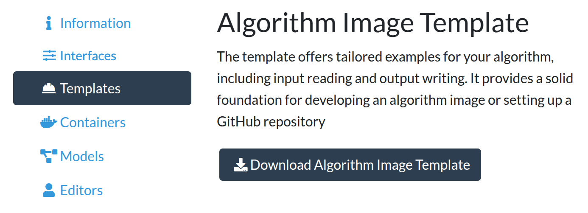

# Crawled Page: Download example code -
    
        Create your own algorithm -
    
    Grand Challenge
- **Source URL:** [https://grand-challenge.org/documentation/download-example-code/](https://grand-challenge.org/documentation/download-example-code/)

---

[←

Define algorithm interfaces](/documentation/choose-input-and-output-interfaces/)

[Build and test the container

→](/documentation/building-and-testing-the-container/)

### Download example code[¶](#download-example-code "Permanent link")

The next step toward deploying your algorithm is to prepare a code base that Docker can use to build a container. To help you, there is example code available to start from. Depending on your role, you can either:

[Clone a repository from a challenge baseline algorithm](#clone-a-repository-from-a-challenge-baseline-algorithm)  
If you are a challenge participant, the challenge organizers should have made a baseline repository available. The baseline algorithm will be a working example of how to load the input(s) and produce an output for that particular challenge. It will therefore be the best starting point. If there is no baseline algorithm available, contact the challenge organizers.

[Download your algorithm image template](#download-your-algorithm-image-template)  
If you have created an algorithm outside of a challenge, you can download an algorithm image template. The template is tailored to your algorithms interface, so set these up first. The code shows how to easily read and write your output, and includes helper scripts for Docker containerisation.

---

#### Clone a repository from a challenge baseline algorithm[¶](#clone-a-repository-from-a-challenge-baseline-algorithm "Permanent link")

If you are a challenge participant and the challenge organizaer have published the baseline example algorithm repository, you can clone it as follows. If there is no baseline algorithm available, contact the challenge organizers.

As Challenge repositories need to be private, we cannot simply fork the baseline repository, because GitHub doesn't allow it. Instead we must clone the baseline, push it to our repository, and clone that repo. Below we outline the steps to this, which we adapted from the [Github docs](https://docs.github.com/en/repositories/creating-and-managing-repositories/duplicating-a-repository).

First, make sure to have [git](https://git-scm.com/book/en/v2/Getting-Started-Installing-Git) and [git-lfs](https://docs.github.com/en/repositories/working-with-files/managing-large-files/installing-git-large-file-storage) installed on your local computer, and [create a  Github account](https://github.com/signup), if you have not already done so.

On GitHub, start by creating a new repository and set it to private. We will call it `your-repo`, but pick a name you like. Next, clone the baseline repository in your local bash terminal by running the following commands – but be sure to replace  `path/to/home` with your desired home path, and replace the URL with the URL of the actual baseline repository + `.git`.

```
$ cd /path/to/home
$ git clone --bare https://github.com/ChallengeOrganizer/algorithm-baseline.git
```

Then go to the baseline repository folder, push it to your-repo , and (optionally) delete the original:

```
$ cd algorithm-baseline.git
$ git push --mirror https://github.com/YourUsername/your-repo.git
$ cd ..
$ rm -rf algorithm-baseline.git
```

Then finally, clone your own repository:

```
$ git clone https://github.com/YourUsername/your-repo.git
```

---

#### Download your algorithm image template[¶](#download-your-algorithm-image-template "Permanent link")

Ensure the interfaces are set up before you continue.

After [setting up the interface(s)](/documentation/choose-input-and-output-interfaces/), algorithm creators can find the template via  *Templates ⟶  Download Algorithm Image Template*:



You can only see the template page if you can add algorithms outside of challenges.

[←

Define algorithm interfaces](/documentation/choose-input-and-output-interfaces/)

[Build and test the container

→](/documentation/building-and-testing-the-container/)