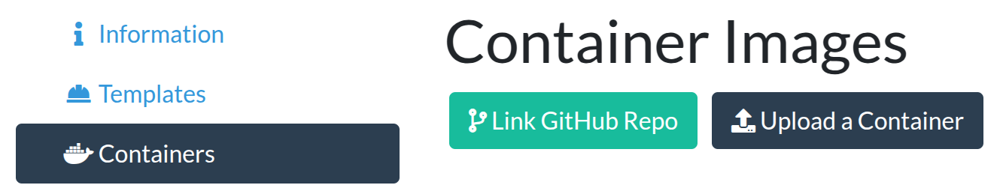

# Crawled Page: Option 2: Uploading the container image -
    
        Deploy your algorithm -
    
    Grand Challenge
- **Source URL:** [https://grand-challenge.org/documentation/exporting-the-container/](https://grand-challenge.org/documentation/exporting-the-container/)

---

[←

Option 1: Linking a GitHub repository](/documentation/linking-a-github-repository-to-your-algorithm/)

[Upload the model weights separately

→](/documentation/upload-the-model-weights-separately/)

### Option 2: Uploading the container image[¶](#option-2-uploading-the-container-image "Permanent link")

Another way to get your Algorithm running on Grand Challenge is to export the container image to a compressed file, and upload it directly to Grand Challenge. To create the container image, run `docker save IMAGE | gzip -c > IMAGE.tar.gz` and wait for a few minutes until the image gets created and zipped into a single file. Alternatively, run `./do_save.sh` if your algorithm template comes with it.

On your Algorithm page, you can upload the `.tar.gz` file by clicking *Containers ⟶ Upload a Container*.

To try out your own algorithm, you will have to wait until your algorithm container image is uploaded and Active.

You can check the status of your container by clicking on *Containers*. Normally, it takes about 20 minutes for your new container to be validated by grand-challenge.org and to become active. If your new container is not active after an hour, please reach out to us.

You do not have to create a new algorithm page for every update to your algorithm. Instead, upload a new container.

You can upload a new container by going to *Containers ⟶ Upload a Container*. Once validated this will become the new active container. You can choose which from the list of previously uploaded containers should be active.

[←

Option 1: Linking a GitHub repository](/documentation/linking-a-github-repository-to-your-algorithm/)

[Upload the model weights separately

→](/documentation/upload-the-model-weights-separately/)