# Crawled Page: Option 1: Linking a GitHub repository -
    
        Deploy your algorithm -
    
    Grand Challenge
- **Source URL:** [https://grand-challenge.org/documentation/linking-a-github-repository-to-your-algorithm/](https://grand-challenge.org/documentation/linking-a-github-repository-to-your-algorithm/)

---

[←

Deploy your algorithm](/documentation/add-the-algorithm/)

[Option 2: Uploading the container image

→](/documentation/exporting-the-container/)

### Option 1: Link a GitHub repository[¶](#option-1-link-a-github-repository "Permanent link")

To get your container running on Grand Challenge, you may want to link a GitHub repository to your Algorithm page. When a repository is linked to an algorithm, a new container image will be built automatically each time the repository is [tagged](https://git-scm.com/book/en/v2/Git-Basics-Tagging). The following requirements need to be met for this workflow to properly work:

* There needs to be a Dockerfile in the repository's root. This Dockerfile will be used to build the image.
* The repository needs to have an open-source license. To ensure your license is valid, you can check if the license is listed in your repository's 'about' section:  
  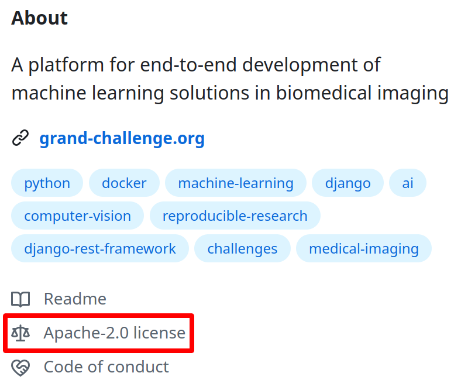
* The Grand Challenge GitHub app needs to be installed in the repository

> ⚠️ Note on GitHub Storage Limits.
>
> If you include the model weights in your GitHub repository, be aware that GitHub enforces bandwidth and storage limits of 1 GiB per month for repository downloads. Your algorithm will not be updated when this limit is exceeded. For larger models or frequent use, consider uploading the container and model weights separately to avoid these limitations.

The following licences are currently recognised by Grand Challenge: Apache Licence 2.0, MIT Licence, GNU GPLv3, GNU AGPLv3, Mozilla Public Licence 2.0, Boost Software Licence 1.0, The Unlicence. If your open-source licence is not listed here, please contact us at [support@grand-challenge.org](mailto:support@grand-challenge.org).

#### Install Grand Challenge GitHub app[¶](#install-grand-challenge-github-app "Permanent link")

To install the Grand Challenge GitHub app, navigate to the `Containers` menu item on your algorithm's page and click the `Link GitHub Repo` button:

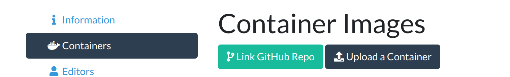

You will be redirected to GitHub. Click `Authorize Grand Challenge`.

You will be shown a dropdown menu with repositories that already have the app installed. Initially, no repositories will be found. Click `update the GitHub installation` to link a new repository.

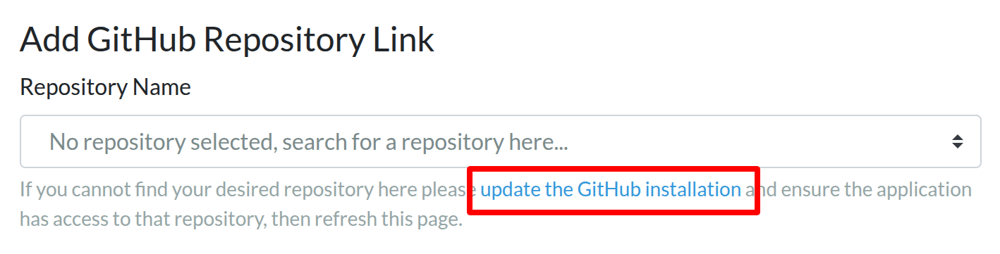

You will now be redirected to GitHub.

Complete the steps to install the app for the proper repository. You must have admin rights to the repository so that you can give permission for Grand Challenge to install an app there.

###### 1. Select your GitHub account[¶](#1-select-your-github-account "Permanent link")

Select the Github account with the (private) repository you want to link here.

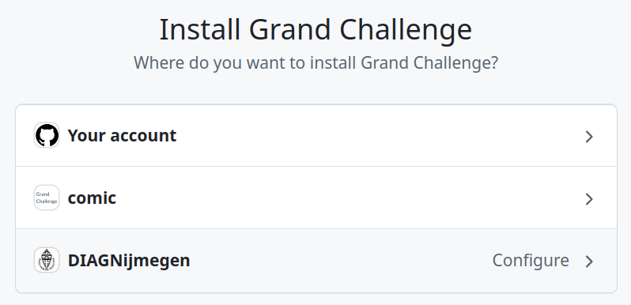

###### 2. Select the GitHub repository you want to link to your algorithm[¶](#2-select-the-github-repository-you-want-to-link-to-your-algorithm "Permanent link")

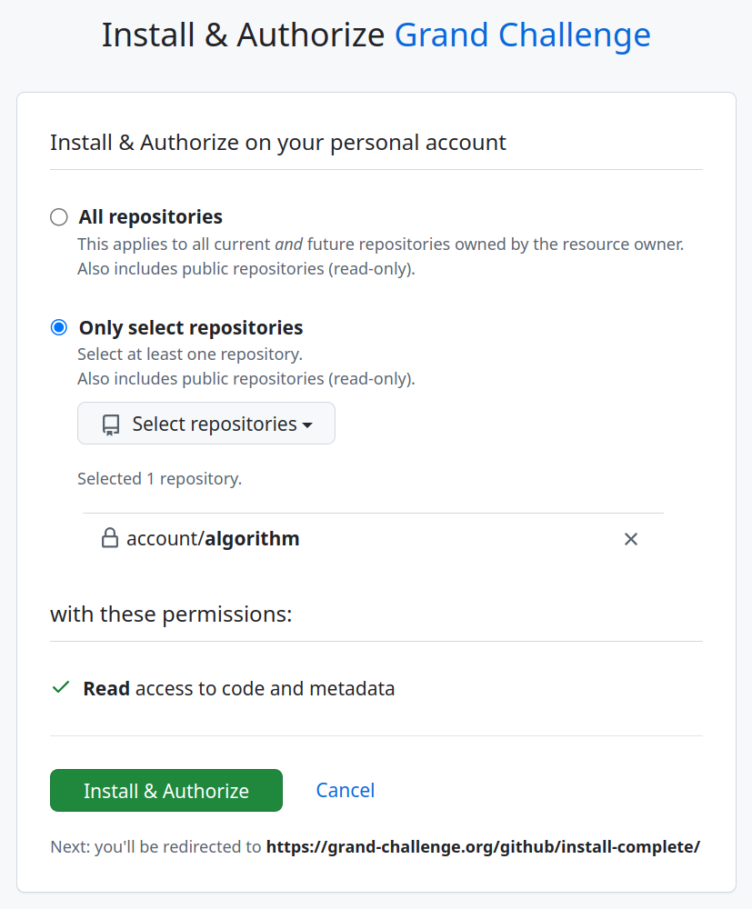

If you see a `request` badge, please see [**Link a GitHub repository without admin access**](#link-a-github-repository-without-admin-access) below. Click `Install and Authorize` after making your selection. You will now be redirected back to Grand Challenge, where you can select your repository in the dropdown menu. Click `Save` to link the repository to your algorithm.

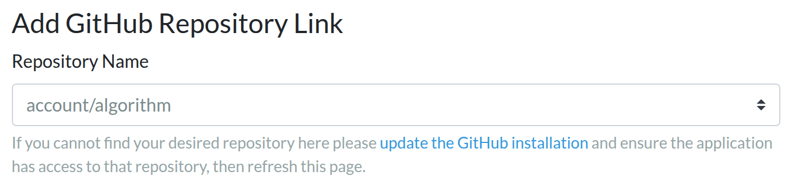

The `Containers` menu item will now display the linked repository.

#### Build Docker Container[¶](#build-docker-container "Permanent link")

You can now start a new build for your algorithm by tagging your linked GitHub repository. A build will be started for each tag. Note that it could take a little while for the build to start as a worker needs to be available to start the build. The builds for your algorithm will be listed in the `Containers` menu item. You can view the build logs for each build by clicking the entry in the overview.

##### Tagging your repository[¶](#tagging-your-repository "Permanent link")

You can tag your repository using the [command line interface](https://git-scm.com/book/en/v2/Git-Basics-Tagging), [GitHub Desktop](https://docs.github.com/en/desktop/contributing-and-collaborating-using-github-desktop/managing-commits/managing-tags#creating-a-tag), your favorite git program, or the [web interface of GitHub](https://docs.github.com/en/repositories/releasing-projects-on-github/managing-releases-in-a-repository). Creating a new release on GitHub will automatically tag your repository

##### Build process[¶](#build-process "Permanent link")

After the repository is tagged, a Docker container will be created automatically using [AWS CodeBuild](https://docs.aws.amazon.com/codebuild/latest/userguide/concepts.html). You can see the progress of this build in the `Containers` menu item.

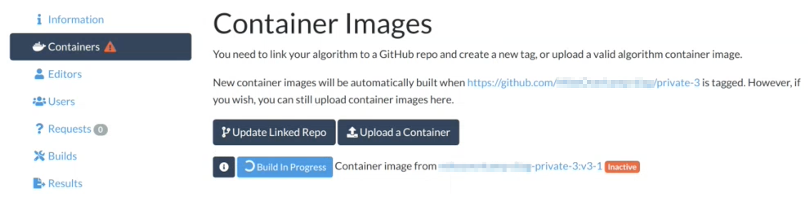

The build logs can be viewed by clicking the `i` button.

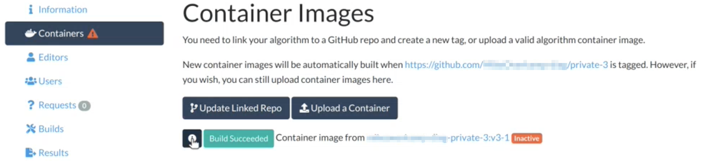

##### Recurse Submodules[¶](#recurse-submodules "Permanent link")

If your repository contains submodules that need to be cloned for the Docker build, enable `Recurse submodules` in the algorithm settings:

###### 1. Update the algorithm settings[¶](#1-update-the-algorithm-settings "Permanent link")

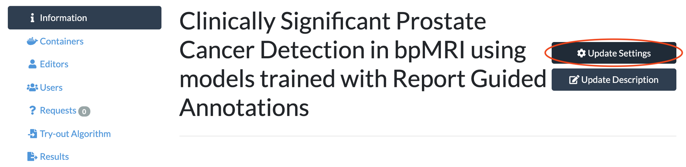

###### 2. Enable Recurse submodules[¶](#2-enable-recurse-submodules "Permanent link")

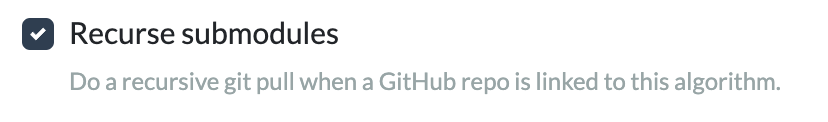

Click `Save` to store the change.

#### Link a GitHub repository without admin access[¶](#link-a-github-repository-without-admin-access "Permanent link")

In case you want to link a GitHub repository you do not have admin access to, the workflow is a little different. This situation can arise, for example, if your repository is managed by your organisation instead of your personal GitHub account. You can recognise this situation from the `request` badge.

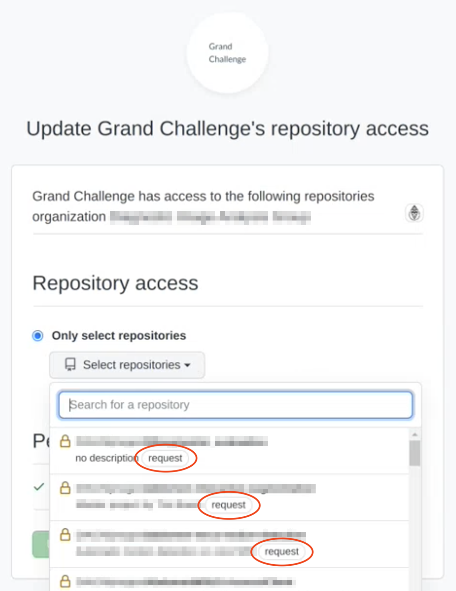

In this case, ask the GitHub admin to install the Grand Challenge app for you. Your organization's GitHub admin can manually install the Grand Challenge app by navigating to [github.com/apps/grand-challenge/installations/new](https://github.com/apps/grand-challenge/installations/new) and selecting the required repositories. This selection is similar to [**2. Select the GitHub repository you want to link to your algorithm**](#2-select-the-github-repository-you-want-to-link-to-your-algorithm) above. However, this does not automatically link the repository to your algorithm. After the app is installed, you can manually link the repository to your algorithm by updating the `Repo name` in your algorithm settings. Write `[your organisation name]/[your repository name]` here:

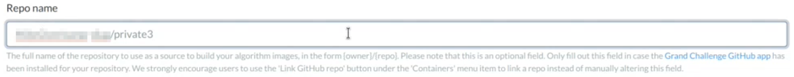

Please note that a repository can only be linked to a single algorithm.

#### Uninstall Grand Challenge GitHub app[¶](#uninstall-grand-challenge-github-app "Permanent link")

To uninstall the GitHub app, navigate to [github.com/settings/installations](https://github.com/settings/installations). Under `Installed GitHub Apps` click on `Configure` next to Grand Challenge.

Scroll to the bottom and click `Uninstall`.

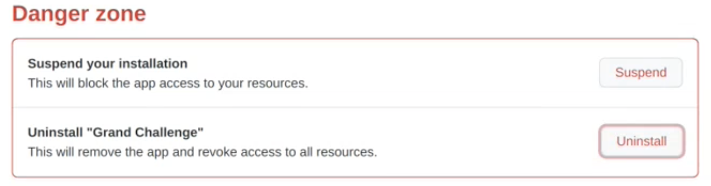

[←

Deploy your algorithm](/documentation/add-the-algorithm/)

[Option 2: Uploading the container image

→](/documentation/exporting-the-container/)