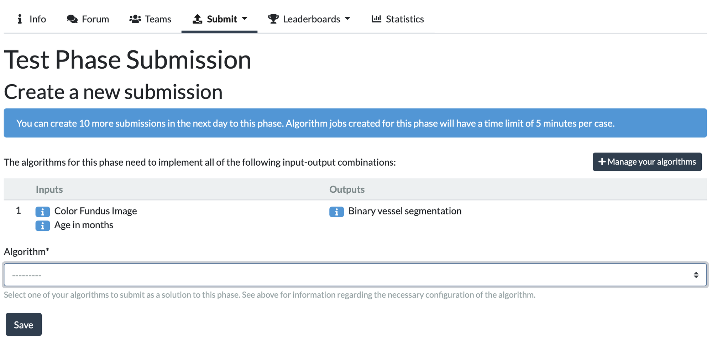

# Crawled Page: Making a Challenge Submission -
    
        Participate in a Challenge -
    
    Grand Challenge
- **Source URL:** [https://grand-challenge.org/documentation/making-a-challenge-submission/](https://grand-challenge.org/documentation/making-a-challenge-submission/)

---

[←

Participate in a Challenge](/documentation/participate-in-a-challenge/)

[Creating or Joining a Team

→](/documentation/creating-or-joining-a-team/)

### Making a Challenge Submission[¶](#making-a-challenge-submission "Permanent link")

#### Submitting Your Algorithm Container[¶](#submitting-your-algorithm-container "Permanent link")

To submit to a challenge:

1. Navigate to the Challenge page
2. Click Submit and select the phase you'd like to submit to
3. Choose from your existing [Algorithms](/algorithms/) (you must be listed as an editor)
4. Or click Manage your algorithms to [create a new one](/documentation/create-an-algorithm-page/#creating-an-algorithm-for-a-challenge)

> 💡 Tip: You do not need to create a new algorithm for every update — simply upload a new container to your existing algorithm.

---

⚠️ Please test your algorithm container locally before uploading.  
You can find detailed instructions in the [container creation](/documentation/create-your-own-algorithm/) and [local testing guide](/documentation/building-and-testing-the-container/).

⚠️ Submission limits are in place to:

* Prevent test set overfitting
* Ensure fairness among participants
* Conserve compute resources

Read more on this in [this blog post](https://imig.science/midog2021/2021/08/25/a-word-about-fairness/) by the MIDOG 2021 organizers.

---

#### Submission Tips[¶](#submission-tips "Permanent link")

* Ensure your user account is verified before submitting
* Configure GPU and memory requirements appropriately
* Be aware that maximum runtime per submission is determined by the challenge phase (typically between 1 minute and 1 hour)
* Container size should be under 10GB and only include the dependencies you need. Model weights should be uploaded separately.
  Compress with gzip for upload:  
  `bash
  docker save your_algorithm | gzip -c > YourAlgorithm.tar.gz`
* Container validation may take up to 24 hours. If your container is not marked as active after that, please [contact support](/contact/).
* To update your algorithm:

  + Upload a new Docker container image on the Container Management page of your algorithm
  + Or tag a new release if your algorithm is linked to a [GitHub repository](/documentation/linking-a-github-repository-to-your-algorithm/)
  + ⚠️ Updating your algorithm does not automatically create a new submission — you must submit it manually to the challenge phase again
* Test before submitting:

  + Use the "Try Out Algorithm" feature to upload test data and verify the outputs
  + Make sure the outputs match what is expected by the challenge phase
  + You can review logs and errors on the Results tab of your algorithm page
* No internet access during execution:

  + All dependencies and model weights must be bundled in your container
  + You can simulate this locally by running:
    `bash
    docker run --network=none ...`
  + If your container tries to access the internet, it will fail with errors like `Temporary failure in name resolution`
* Debugging failed submissions:

  + Go to `All Submissions` under the `Submit` tab and navigate to the (failed) submission you would like to debug by clicking on . On the submission detail page, you will find the error message, as well as suggestions for concrete next steps.
  + By default, participants do not have access to the logs that their algorithm produces for challenge submissions (to avoid leaking test set information), so often it will be necessary to contact the challenge organizers for help.
  + If the challenge is set-up in such a way that you do have access to your algorithm's logs, the submission detail page will contain a link to those logs.
  + Tip: most issues can be caught by testing your container with "Try Out Algorithm" first
* Be patient — evaluation may take time depending on system load

  + If your submission has not been evaluated after 24 hours, feel free to [reach out to support](/contact/)

[←

Participate in a Challenge](/documentation/participate-in-a-challenge/)

[Creating or Joining a Team

→](/documentation/creating-or-joining-a-team/)