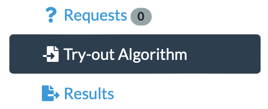
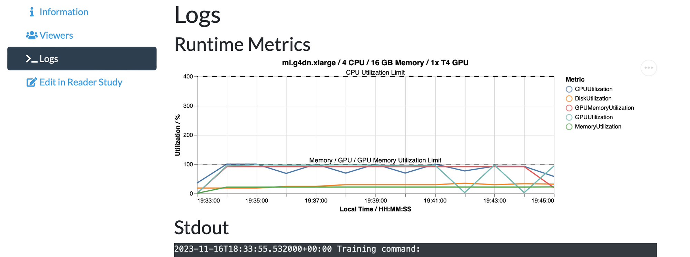

# Crawled Page: Runtime Environment -
    
        Algorithms -
    
    Grand Challenge
- **Source URL:** [https://grand-challenge.org/documentation/runtime-environment/](https://grand-challenge.org/documentation/runtime-environment/)

---

[←

Setting up Docker on Windows](/documentation/setting-up-wsl-with-gpu-support-for-windows-11/)

[Challenges

→](/documentation/challenges/)

### Runtime Environment[¶](#runtime-environment "Permanent link")

A container will be created from the container image whenever you create a job for your algorithm. You can use the "Try Out Algorithm" button to test your container on the platform with your own data.

Any output for both `stdout` and `stderr` is captured. The output for `stderr` gets marked as a warning in the job's result. If an algorithm does not properly run, it should exit with a non zero exit code. The job for the algorithm then gets marked as failed. Runtime metrics are available on the logs page of your job.

#### Restrictions[¶](#restrictions "Permanent link")

Your container will be executed on one case at a time and is subject to a number of restrictions.

##### Non-Root User[¶](#non-root-user "Permanent link")

Containers should run as a non-root user. In the context of the container, the user should exist and have the necessary permissions for application execution without elevated privileges.

##### No Network Access[¶](#no-network-access "Permanent link")

Your container will be executed without access to any network resources. This is to prevent exfiltration of private data uploaded by users or used in the challenge. Your container therefore must include everything it needs to run at build time.

##### `/tmp` Will Be Empty[¶](#tmp-will-be-empty "Permanent link")

The `/tmp` directory will be completely empty at runtime. This is scratch space that you can use for transient files, and will usually have a fast NVMe device attached. Any files that you included in `/tmp` in your Dockerfile will not be present at runtime. It is best practice to add these somewhere else, for example in a subdirectory of `/opt`.

##### `/input` Is Read Only[¶](#input-is-read-only "Permanent link")

The input directory is read only. `/tmp` and `/output` are fully writable by your process.

##### 50% Of System Memory Is Shared[¶](#50-of-system-memory-is-shared "Permanent link")

The Shared Memory available to your container at `/dev/shm` is 50% of the System Memory. For example, for a 16 GiB instance, `/dev/shm` will be 8 GiB. The percentage is not modifiable.

##### 1 GiB Of System Memory Is Reserved[¶](#1-gib-of-system-memory-is-reserved "Permanent link")

1 GiB of memory will be reserved for system processes, so if you request a 32 GiB system 31 GiB will be available for your processes.

##### The Time Limit Is Set By The Phase[¶](#the-time-limit-is-set-by-the-phase "Permanent link")

The maximum runtime is set by the phase of the challenge that you are submitting to. Ensure that your container can produce its output in that time.

##### Instance Types[¶](#instance-types "Permanent link")

You can specify the GPU and Memory options in your Algorithm settings. Depending on the GPU and amount of memory you requested, one of the following instances will be selected for your algorithms runtime environment:

| Instance Type | GPU | GPU Memory (VRAM) | vCPUs | Main Memory (DRAM) | `/tmp` Storage |
| --- | --- | --- | --- | --- | --- |
| `ml.m7i.large` | No GPU | - | 2 | 8 GiB | 30+ GB EBS Volume |
| `ml.r7i.large` | No GPU | - | 2 | 16 GiB | 30+ GB EBS Volume |
| `ml.r7i.xlarge` | No GPU | - | 4 | 32 GiB | 30+ GB EBS Volume |
| `ml.g4dn.xlarge` | 1x NVIDIA T4 GPU | 16 GB | 4 | 16 GiB | 1 x 125 GB NVMe SSD |
| `ml.g4dn.2xlarge` | 1x NVIDIA T4 GPU | 16 GB | 8 | 32 GiB | 1 x 225 GB NVMe SSD |
| `ml.g5.xlarge` | 1x NVIDIA A10G GPU | 24 GB | 4 | 16 GiB | 1 x 250 GB NVMe SSD |
| `ml.g5.2xlarge` | 1x NVIDIA A10G GPU | 24 GB | 8 | 32 GiB | 1 x 450 GB NVMe SSD |

[M7i instances](https://aws.amazon.com/ec2/instance-types/m7i/) and [R7i instances](https://aws.amazon.com/ec2/instance-types/r7i/) use 4th Generation Intel Xeon Scalable processors (Sapphire Rapids). These M7i and R7i instances have at least 30GB of EBS (non-NVMe) storage mounted at `/tmp`, the size of this volume will scale with the size of your model/ground truth and input data. All R7i instances with up to 192 CPU and 1536 GiB of DRAM are available on request, and can be activated for your challenge by contacting support.

[G4dn instances](https://aws.amazon.com/ec2/instance-types/g4/) feature 1x NVIDIA T4 GPUs with 16 GB GDDR6 300 GB/sec GPU Memory and custom Intel Cascade Lake processors.

[G5 instances](https://aws.amazon.com/ec2/instance-types/g5/) feature 1x NVIDIA A10G GPUs with 24 GB GDDR6 600 GB/sec GPU Memory and second generation AMD EPYC processors.

Please note that you can only request GPU instances if they have been enabled for your organization or for a challenge that you participate in.

Currently NVIDIA Driver Version 535 and CUDA Version 12.0 are used.

You can see the specifications of the instance that was used for the Algorithm Job on the Jobs log page, on the chart where the resource usage is displayed.

[←

Setting up Docker on Windows](/documentation/setting-up-wsl-with-gpu-support-for-windows-11/)

[Challenges

→](/documentation/challenges/)