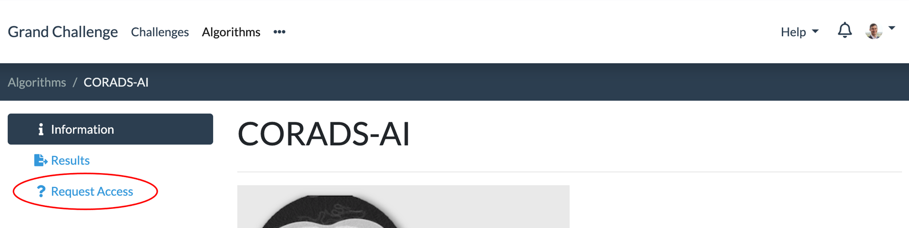
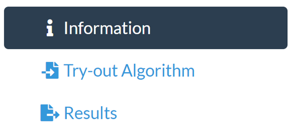
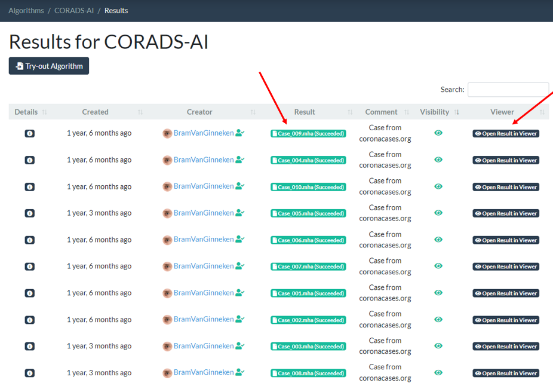
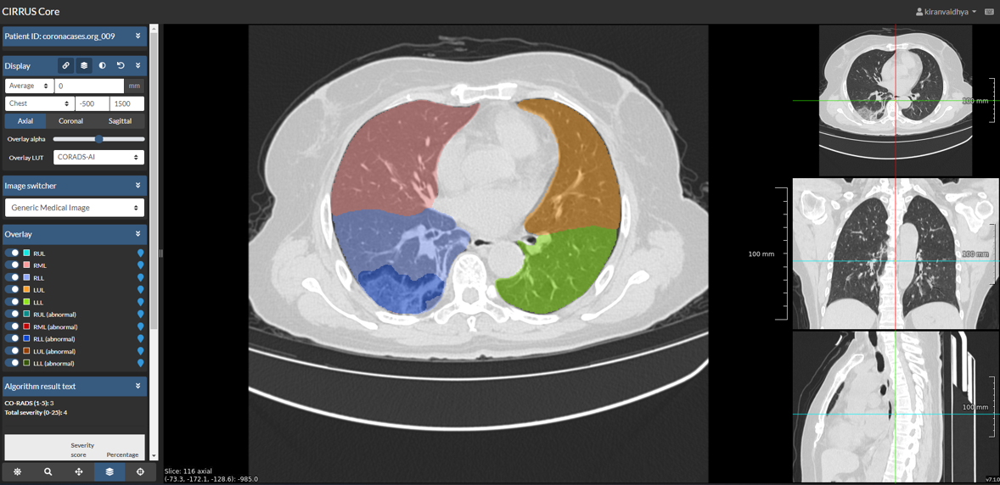
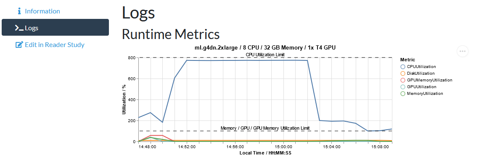

# Crawled Page: Try out an algorithm -
    
        Algorithms -
    
    Grand Challenge
- **Source URL:** [https://grand-challenge.org/documentation/try-out-your-algorithm/](https://grand-challenge.org/documentation/try-out-your-algorithm/)

---

[←

Algorithms](/documentation/algorithms/)

[Create your own algorithm

→](/documentation/create-your-own-algorithm/)

### Try out an algorithm[¶](#try-out-an-algorithm "Permanent link")

#### Request Access[¶](#request-access "Permanent link")

Prior to using an algorithm, you need to request access. You do not need to request permission if you are using your own algorithm. To request access, navigate to the algorithm, and click on "Request Access", as shown below. This request needs to be accepted by the Algorithm Editors before you can use the algorithm.

If the Algorithm Editors do not respond, the Grand Challenge support cannot bypass this access-request step. If this happens, you can contact the Algorithm Editors directly through their contact email listed on the algorithm page.

If the Algorithm requests are configured to only automatically approve requests of users that are verified, the pending request will be automatically approved when your account becomes verified.

#### Try-out Algorithm[¶](#try-out-algorithm "Permanent link")

The easiest way to start a job is by navigating and clicking on the Try-out Algorithm option from the side menu or from the Results page

On this page, you can optionally select the appropriate input combinations to use for the job (if there is only 1 option, this selection will automatically be made for you), and then simply drag and drop your inputs or images, and then click on the Save button to start the job.

#### Using gcapi[¶](#using-gcapi "Permanent link")

The second way to run algorithm jobs is to use the [Grand Challenge API Client](https://diagnijmegen.github.io/rse-gcapi/) to start an algorithm job through Python.

---

Each method will require you to provide all the inputs defined for one of the interfaces (i.e., input-output combinations) of the algorithm. After submitting the inputs, the algorithm job will be queued and the job will be visible on the Results page.

---

#### Viewing results[¶](#viewing-results "Permanent link")

To view the results of your jobs, click on the Results page and then click on your result to view the outputs, or click Open Result in Viewer to view your image with one of our image viewers.

When you click you Open Result in Viewer, you will be redirected to a CIRRUS viewer that will display the outputs of the algorithm like in this example from the [CORADS-AI](/algorithms/corads-ai/) algorithm.

#### Logs and metrics[¶](#logs-and-metrics "Permanent link")

To view the logs of your algorithm, click on the Results page and then click on your result and View result details. In the tab Logs, you will find a chart, showing metrics regarding CPU, GPU and memory usage. It will also show stdout and stderr produced by your algorithm.

#### Credits[¶](#credits "Permanent link")

💳 Running an algorithm job requires credits. The amount of credits per job will be automatically set depending on your algorithms compute requirements and historical runtime, with a minimum of 20 credits. Each user has 1000 credits per month at their disposal.

#### Job permissions[¶](#job-permissions "Permanent link")

The permissions for who can view each job depend on how the job was created. Each algorithm has its own editors group, and each job has its own viewers group. Users with the "Change this job" permission can add users to the job viewers group, granting them the "View this job" permission. Users with the "View this jobs logs" permission also need the "View this job" permission bit to actually view the logs.

##### Permission when the job is directly created by a user through the API or HTML Forms[¶](#permission-when-the-job-is-directly-created-by-a-user-through-the-api-or-html-forms "Permanent link")

| User/Group | Permission |
| --- | --- |
| Job Creator | Change this job |
| Algorithm Editors Group | View this jobs logs |
| Job Viewers Group (contains the job creator) | View this job |

##### Permission when the job is created as part of a challenge submission[¶](#permission-when-the-job-is-created-as-part-of-a-challenge-submission "Permanent link")

Each challenge will have its own admin group who will be able to view the jobs and logs for debugging. The submission creator will not be able to see the job to prevent leaking of the test set.

| User/Group | Permission |
| --- | --- |
| Job Creator | There is no creator as the job was created by the system |
| Algorithm Editors Group | No Permissions |
| Job Viewers Group (empty) | View this job |
| Submission Creator | No permissions |
| Challenge Administrators Group | View this job, View this jobs logs |

#### Job execution times[¶](#job-execution-times "Permanent link")

⚠️ The algorithm jobs are executed on [AWS SageMaker](https://aws.amazon.com/sagemaker/) where we limit the number of instances we use. This means that the job will only be executed when an instance becomes available. There is no way to predict how long it will take before an instance becomes available (might take more than a day) or to move a job further up in the queue.

#### Job status meaning[¶](#job-status-meaning "Permanent link")

When you start an algorithm job it progresses through a number of different states. First, the job inputs are provisioned and the task is then put into the "provisioned" state. The task then waits for an available instance in our cluster. When your job is assigned to an instance it will be in the "executing" state. Once the algorithm job has run, your job's status will update to either "failed", "successful" or "cancelled".

[←

Algorithms](/documentation/algorithms/)

[Create your own algorithm

→](/documentation/create-your-own-algorithm/)