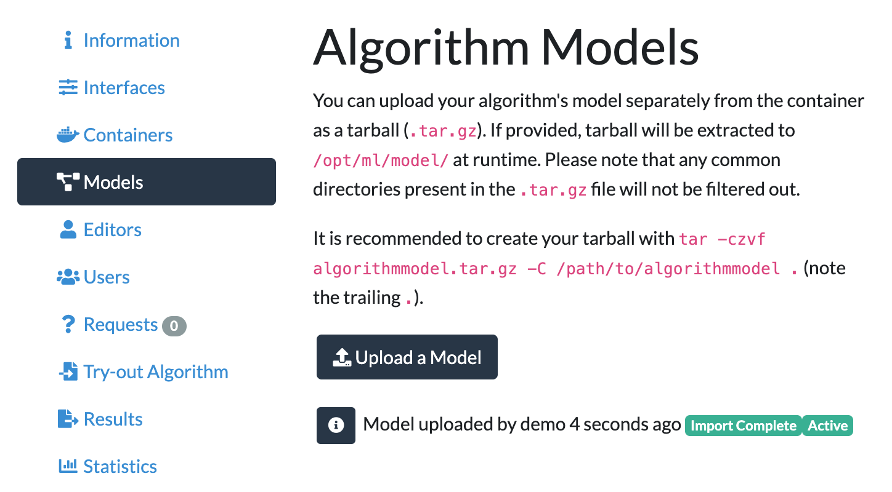

# Crawled Page: Upload the model weights separately -
    
        Create your own algorithm -
    
    Grand Challenge
- **Source URL:** [https://grand-challenge.org/documentation/upload-the-model-weights-separately/](https://grand-challenge.org/documentation/upload-the-model-weights-separately/)

---

[←

Option 2: Uploading the container image](/documentation/exporting-the-container/)

[Try out your algorithm and publish a test case

→](/documentation/try-out-your-algorithm-and-publish-a-test-case/)

### Upload the model weights separately[¶](#upload-the-model-weights-separately "Permanent link")

If you choose to upload the weights separately, go to the *Models* page of your algorithm and upload the model files as a compressed tarball. The script `do_save.sh` from the [algorithm image template](/documentation/download-example-code/#option-2-download-your-algorithm-image-template) automatically creates a tarball of the contents of the model directory.

During inference, the tarball will be extracted and made available to your container at `/opt/ml/model/`.

[←

Option 2: Uploading the container image](/documentation/exporting-the-container/)

[Try out your algorithm and publish a test case

→](/documentation/try-out-your-algorithm-and-publish-a-test-case/)