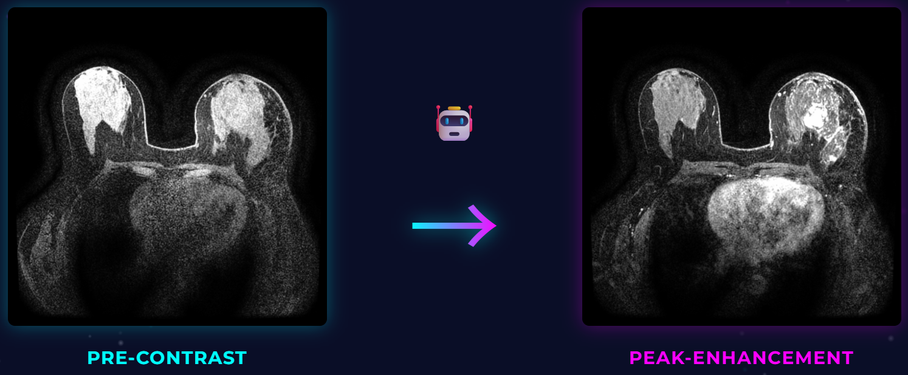

# Crawled Page: 
            
    Introduction - The MAMA-SYNTH Challenge - Grand Challenge

            
                
            
        
- **Source URL:** [https://mamasynth.grand-challenge.org/mamasynth/](https://mamasynth.grand-challenge.org/mamasynth/)

---

### **MAMA-SYNTH 2026**[¶](#mama-synth-2026 "Permanent link")

#### **Synthesizing Virtual Contrast-Enhancement in Breast MRI**[¶](#synthesizing-virtual-contrast-enhancement-in-breast-mri "Permanent link")

MAMA-SYNTH is a challenge focused on synthesizing **virtual post-contrast breast MRI** from **pre-contrast T1-weighted MRI**. The benchmark is designed to support the development of clinically meaningful **contrast-reduced** and **contrast-free** breast MRI workflows.

🔗 **Official website:** [MAMA-SYNTH Challenge](https://www.ub.edu/mama-synth/mama-synth)

🗂️ **Proposal**: [Zenodo](https://zenodo.org/records/19852228)

💻**Preprocessing & Evaluation Code:** [github.com/mama-research/mama-synth/](https://github.com/mama-research/mama-synth/)

Dynamic contrast-enhanced MRI (DCE-MRI) plays a central role in breast cancer diagnosis, treatment planning, and disease monitoring. However, the use of gadolinium-based contrast agents introduces important concerns related to **patient safety**, **environmental contamination**, and **accessibility of advanced imaging workflows**. MAMA-SYNTH provides a standardized evaluation framework for generative models that aim to recover diagnostically relevant post-contrast information from non-contrast acquisitions.

This challenge is intended to support fair and open comparison of synthesis methods across institutions, imaging settings, and downstream clinical objectives.

#### 🎯 **Challenge Objective**[¶](#challenge-objective "Permanent link")

Participants are asked to generate **single-timepoint 2D peak-enhancement post-contrast breast DCE-MRI slices** from corresponding **pre-contrast T1-weighted MRI inputs**.

More specifically, each submitted method should take a pre-contrast breast MRI slice as input and produce a synthetic post-contrast image corresponding to the **peak-enhancement phase**. The challenge is designed not only to assess image similarity, but also to evaluate whether synthesized images preserve clinically meaningful tumor information.

#### 💡 **Why This Challenge Matters**[¶](#why-this-challenge-matters "Permanent link")

The motivation for MAMA-SYNTH is both clinical and practical.

* **Clinical relevance**: Contrast-enhanced breast MRI is highly valuable for lesion visualization, diagnosis, and treatment planning.
* **Safety motivation**: Repeated exposure to gadolinium-based contrast agents remains a concern, particularly in patients requiring longitudinal imaging and pre-existing conditions.
* **Environmental motivation**: Gadolinium contamination has been detected in water systems, raising broader concerns beyond clinical use alone.
* **Accessibility motivation**: Contrast-enhanced MRI increases scan complexity, cost, and resource requirements, which may limit access in some settings.

By enabling rigorous comparison of virtual contrast-enhancement methods, MAMA-SYNTH aims to support the development of imaging workflows that are safer, more scalable, and more widely accessible.

#### **Data Summary**[¶](#data-summary "Permanent link")

A multi-center benchmark is provided to evaluate the robustness and generalizability of synthesis methods.

* **Training cohort**: **MAMA-MIA** dataset, including **1,506 patients** from **25+ centers** in the United States
* **External test cohorts**:
  + **Radboud University Medical Centre**, The Netherlands — **200 cases**
  + **Instituto Alexander Fleming**, Argentina — **100 cases**

The challenge uses external institutional test cohorts to promote fair evaluation across scanners, protocols, and patient populations.

#### **Evaluation Summary**[¶](#evaluation-summary "Permanent link")

Submissions are assessed across four complementary dimensions:

1. **Image-to-image fidelity**
2. **ROI-to-ROI tumor realism**
3. **Downstream classification performance**
4. **Downstream segmentation performance**

This evaluation design aims to reward methods that are not only visually plausible, but also clinically useful.

#### **Challenge Phases**[¶](#challenge-phases "Permanent link")

The challenge is organized into multiple phases to support method development, validation, and final testing.

* **Validation phase**: participants can test and refine their methods under the official submission framewor using 50 representative cases.
* **Test phase**: final submissions are evaluated on the hidden test data consisting 300 cases and used for the official ranking.

#### 📅 **Important Dates**[¶](#important-dates "Permanent link")

* **May 8, 2026** – Validation phase opens
* **June 25, 2026** – Test phase opens
* **July 10, 2026** – Last submission deadline
* **August 1, 2026** – Official results release
* **September 27, 2026** – Winners announcement at the **Deep-Breath Workshop (MICCAI 2026)**

#### 🚀 **Participation**[¶](#participation "Permanent link")

Participants should submit their methods through the **Grand Challenge** platform.

Teams may use the provided challenge data and additional **publicly available datasets**, subject to the challenge rules. The use of **private datasets** is not allowed.

We envision that MAMA-SYNTH will enable a fair and clinically meaningful comparison of virtual contrast-enhancement methods for breast MRI, and help advance research toward safer and more accessible imaging workflows.

#### 📬 **Contact**[¶](#contact "Permanent link")

For inquiries, please contact:

* **Smriti Joshi** — [smriti.joshi@ub.edu](mailto:smriti.joshi@ub.edu)
* **Richard Osuala** — [richard.osuala@gmail.com](mailto:richard.osuala@gmail.com)
* **Jarek van Dijk** — [jarek.vandijk@radboudumc.nl](mailto:jarek.vandijk@radboudumc.nl)