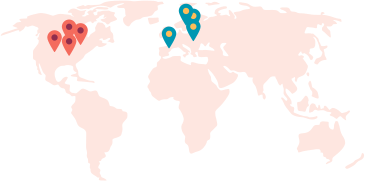
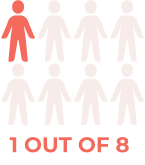
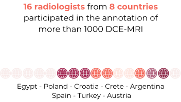
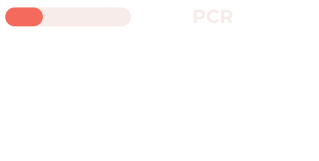
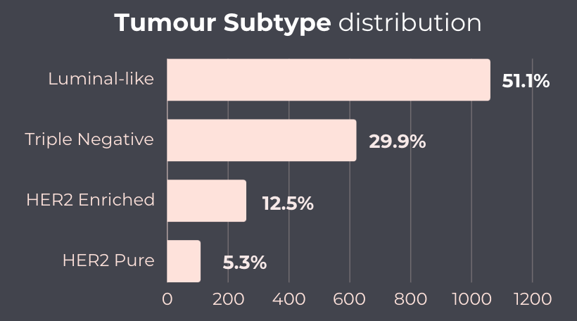

# Crawled Page: Dataset – MAMA-MIA Challenge
- **Source URL:** [https://www.ub.edu/mama-mia/dataset/](https://www.ub.edu/mama-mia/dataset/)

---




+

public **training cases** from **United States**


+

private **test cases** from **Europe**



women is going to develop invasive breast cancer

## Primary Tumour Segmentations




## Annotation Protocol


## Training Dataset Infographics






## Dataset Tables

[Train Dataset Table](https://www.ub.edu/mama-mia/wp-content/uploads/2025/02/Train-Dataset-Table-1.pdf)[Download](https://www.ub.edu/mama-mia/wp-content/uploads/2025/02/Train-Dataset-Table-1.pdf)

[Test Dataset Table](https://www.ub.edu/mama-mia/wp-content/uploads/2024/12/Test-Dataset-Table-3.pdf)[Download](https://www.ub.edu/mama-mia/wp-content/uploads/2024/12/Test-Dataset-Table-3.pdf)

### Cite the dataset:

```
@article{garrucho2025large,
  title={A large-scale multicenter breast cancer DCE-MRI benchmark dataset with expert segmentations},
  author={Garrucho, Lidia and Kushibar, Kaisar and Reidel, Claire-Anne and Joshi, Smriti and Osuala, Richard and Tsirikoglou, Apostolia and Bobowicz, Maciej and Del Riego, Javier and Catanese, Alessandro and Gwo{\'z}dziewicz, Katarzyna and others},
  journal={Scientific data},
  volume={12},
  number={1},
  pages={453},
  year={2025},
  publisher={Nature Publishing Group UK London}
}
```

[mamamia\_dataset\_paper](https://www.ub.edu/mama-mia/wp-content/uploads/2025/03/mamamia_dataset_paper.pdf)[Download](https://www.ub.edu/mama-mia/wp-content/uploads/2025/03/mamamia_dataset_paper.pdf)