# Crawled Page: MAMA-MIA Challenge
- **Source URL:** [https://www.ub.edu/mama-mia/](https://www.ub.edu/mama-mia/)

---

**Advancing **Generalizability** and **Fairness** in Breast MRI Tumour Segmentation and Treatment Response Prediction**

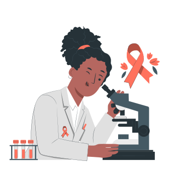

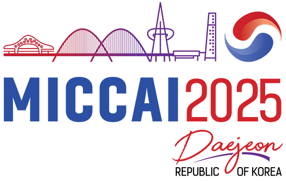

## 23 September Daejeon Convention Center South Korea

### Join the MAMA-MIA Challenge

[EXPLORE THE DATASET](https://doi.org/10.7303/syn60868042)

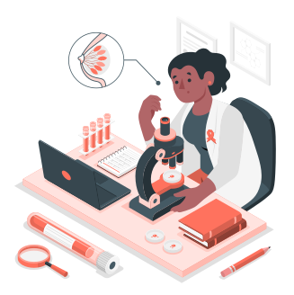

###### About

### **Advancing Breast Cancer Care with AI**

Breast cancer remains the most common cancer among women and a leading cause of female mortality. Dynamic contrast-enhanced MRI (DCE-MRI) is a powerful imaging tool for evaluating breast tumours, yet the field lacks a standardized benchmark for analyzing treatment responses and guiding personalized care.

The **MAMA-MIA Challenge** bridges this gap by introducing a dual-task framework to advance AI-driven solutions for:  
  
1) **Primary Tumour Segmentation in DCE-MRI**  
  
2) **Prediction of Pathologic Complete Response (pCR) to Neoadjuvant Chemotherapy (NAC)**  
  
Participants will use the largest homogenized DCE-MRI dataset to date, featuring 1,506 annotated scans and key clinical variables, and validate their models across 574 external cases from diverse imaging protocols and settings. The challenge emphasizes generalizability and fairness, ensuring equitable model performance across demographic subgroups, and aims to optimize breast cancer treatment and surgical planning.  
  
**Join us to push the boundaries of personalized and ethical AI in breast cancer care.**

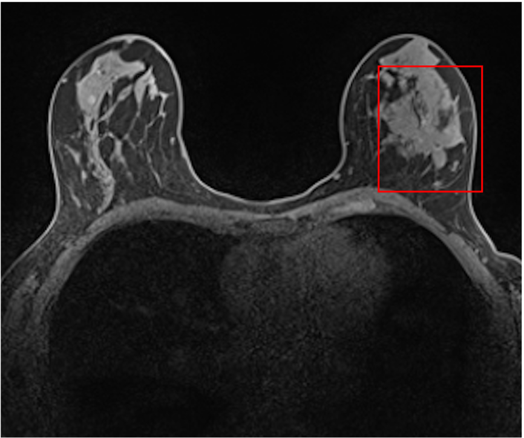

Pre-contrast

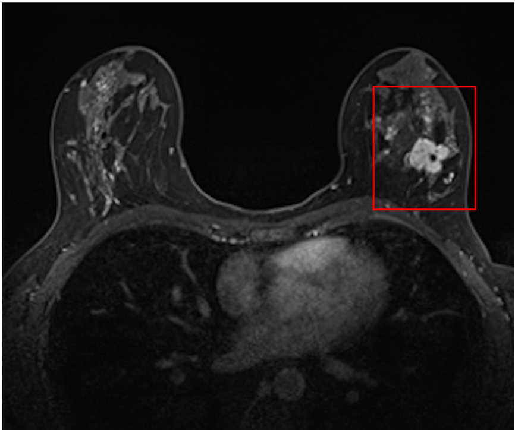

Post-contrast

[The\_MAMA\_MIA\_Challenge\_Paper\_Preprint](https://www.ub.edu/mama-mia/wp-content/uploads/2026/03/The_MAMA_MIA_Challenge_Paper_Preprint-1.pdf)[Download](https://www.ub.edu/mama-mia/wp-content/uploads/2026/03/The_MAMA_MIA_Challenge_Paper_Preprint-1.pdf)

### **Codabench** is Now Open for Submissions!

The challenge will consist of **3 phases**:   
  
1. A **sanity check phase** (using 4 random cases of the training dataset):  
 Get familiar with Codabench enviroment and test that your submission work.  
  
2. A **validation phase** on private data (58 cases):   
 Use this phase to improve your models on the test dataset  
 and see your ranking on the Leaderboard.  
  
3. A **test phase** on private data (512 cases):  
 A single final submission to win the challenge!  
  
Each task (1) **Primary Tumour Segmentation** and (2) **Treatment Response Prediction**  
will have independent phases and Leaderboards. Feel free to submit to one or both!

### **MAMA-MIA Challenge Early Accepted at MICCAI 2025!**

Great news 😊 ! The MAMA-MIA Challenge has been **Early Accepted** at **MICCAI 2025**. Be part of this exciting journey and contribute to advancing breast cancer research!

### **Training Dataset Now Available!**

Start working on your models! The **MAMA-MIA training dataset** is now available on **[Synapse](https://doi.org/10.7303/syn60868042)**. Access the data, experiment, and get ready to submit your best results! 🚀

### Join the MAMA-MIA Slack!

Be part of our community! We’ve created a **[dedicated Slack Workspace](https://join.slack.com/t/mama-miachallenge/shared_invite/zt-312dm4c8m-K0vjWki_2mVbHid7xs71KQ)** with various channels for open discussions, quick Q&A, and seamless collaboration.

###### Event Schedule

### Check the Challenge Calendar

###### Available

##### TRAINING DATASET RELEASE

###### April 16, 2025

##### Sanity check phase

###### MAY 15, 2025

##### Validation phase

###### June 25, 2025

##### Deep-breath workshop paper submission

###### July 15, 2025

##### TEST PHASE START

###### July 31, 2025

##### last submission

###### September 23-27, 2025

##### miccai 2025

###### September 23 Deep-Breath Workshop

##### winners announcement

#### Our TEAM

# Thank You to Our Collaborators

[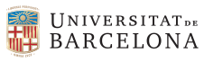](https://web.ub.edu/en/home)

[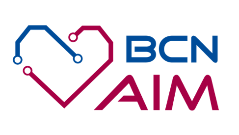](https://www.bcn-aim.org/)

[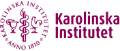](https://ki.se/en)

[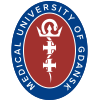](https://mug.edu.pl/)

[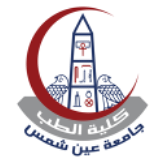](https://www.asu.edu.eg/healthcare)

[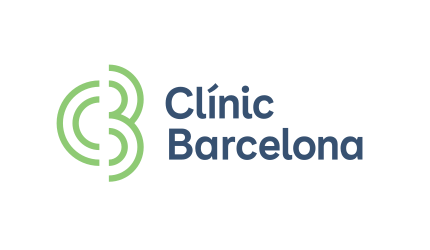](https://www.clinicbarcelona.org/en)

[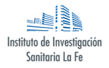](https://www.iislafe.es/en/)

[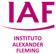](https://alexanderfleming.org/)

[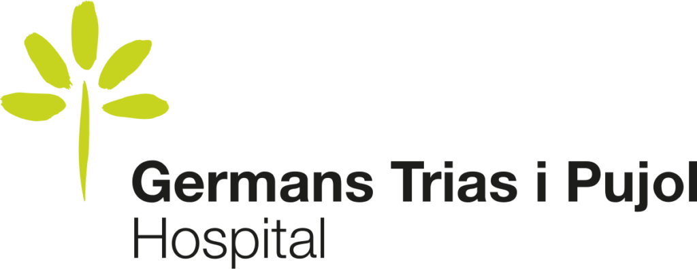](https://www.hospitalgermanstrias.cat/web/guest)

## **Organizers**

---

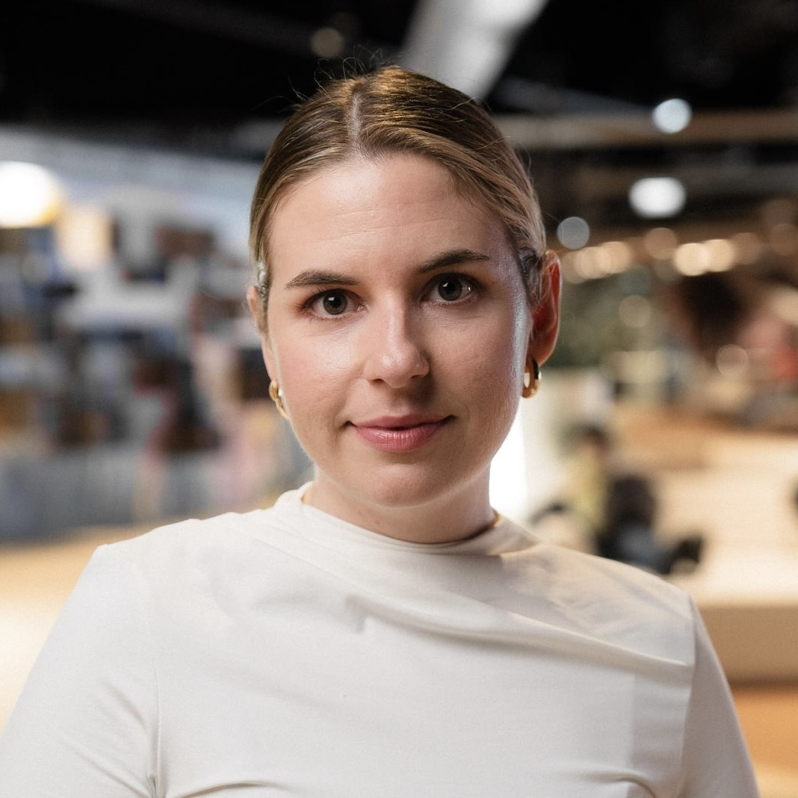

### Lidia Garrucho

PhD Student

**Universitat de Barcelona, Spain**

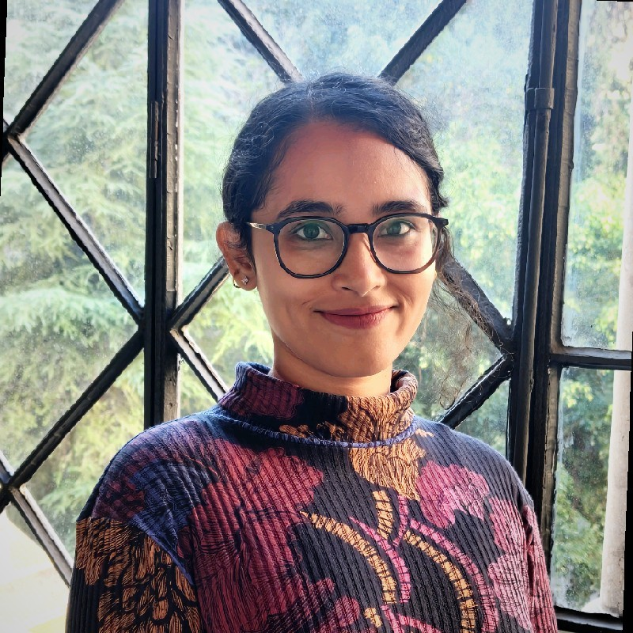

### Smriti Joshi

PhD Student

**Universitat de Barcelona, Spain**

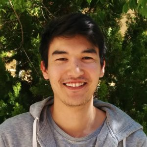

### Kaisar Kushibar

Assistant Professor

**Universitat de Barcelona, Spain**

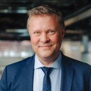

### Maciej Bobowicz

Expert Clinician, MD

**Medical University of Gdansk, Poland**

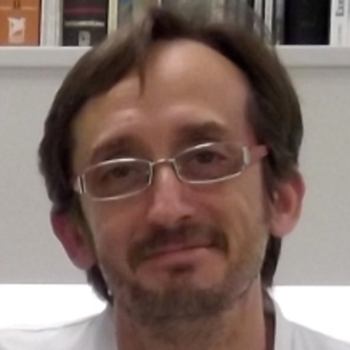

### Xavier Bargalló

Expert Clinician, MD

**Hospital Clinic, Spain**

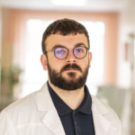

### Paulius Jaruševičius

Expert Clinician, MD

**Kauno Hospital, Lithuania**

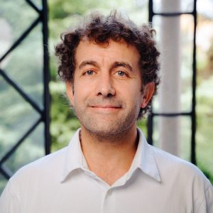

### Karim Lekadir

BCN-AIM Director & ICREA Research Professor

**Universitat de Barcelona, Spain**

## **Technical Committee**

---

* **Tianyu Zhang** (Radboud University Medical Centre, and Netherlands Cancer Institute (NKI))
* **Claire-Anne Reidel** (Post-doc, Darmstadt, Deutschland)
* **Carlos Martín-Isla** (Universitat de Barcelona, Spain)
* **Richard Osuala** (Universitat de Barcelona, Spain)
* **Vien Ngoc Dang** (Universitat de Barcelona, Spain)
* **Dimitri Kessler** (Universitat de Barcelona, Spain)
* **Laura Igual** (Universitat de Barcelona, Spain)
* **Oliver Díaz** (Universitat de Barcelona, Spain)
* **Apostolia Tsirikoglou** (Karolinska Institutet, Sweden)
* **Fredrik Strand** (Karolinska Institutet, Sweden)

## ****Clinical Committee****

---

* **Javier del Riego** (Parc Taulí Hospital Universitari, Spain)
* **Alessandro Catanese** (Hospital Germans Trias i Pujol, Spain)
* **Juozas Kupčinskas** (KAUNO Hospital, Lithuania)
* **Katarzyna Gwoździewicz** (Medical University of Gdansk, Poland)
* **Maria-Laura Cosaka** (Centro Mamario Instituto Alexander Fleming, Argentina)
* **Pasant M. Abo-Elhoda** (Ain Shams University, Egypt)
* **Sara W. Tantawy** (Ain Shams University, Egypt)
* **Shorouq S. Sakrana** (Ain Shams University, Egypt)
* **Norhan O. Shawky-Abdelfatah** (Ain Shams University, Egypt)
* **Amr Muhammad Abdo-Salem** (Ain Shams University, Egypt)
* **Androniki Kozana** (University Hospital of Heraklion, Greece)
* **Eugen Divjak** (University Hospital Dubrava, Croatia)
* **Gordana Ivanac** (University Hospital Dubrava, Croatia)
* **Katerina Nikiforaki** (Foundation for Research and Technology-Hellas, Greece)
* **Michail E. Klontzas** (University of Crete, Greece)
* **Rosa García-Dosdá** (Universitary and Politechnic Hospital La Fe, Spain)
* **Meltem Gulsun-Akpinar** (Faculty of Medicine Sihhiye, Turkey)
* **Oğuz Lafcı** (Medical University of Vienna, Austria)
* **Ritse Mann** (Radboud University Medical Center, The Netherlands)

###### Ready to Join?

### The MAMA-MIA Challenge

Don’t miss out on this opportunity to contribute to breast cancer research and be a part of a groundbreaking event.

[JOIN THE SLACK CHANNEL](https://join.slack.com/t/mama-miachallenge/shared_invite/zt-312dm4c8m-K0vjWki_2mVbHid7xs71KQ)