# Crawled Page: MAMA-SYNTH Challenge | MICCAI 2026
- **Source URL:** [https://www.ub.edu/mama-synth/mama-synth](https://www.ub.edu/mama-synth/mama-synth)

---

# MAMA-SYNTH

Synthesizing Virtual Contrast-Enhancement in Breast MRI

[Participate on Grand Challenge](https://mamasynth.grand-challenge.org/)

## Context

Dynamic contrast-enhanced MRI (DCE-MRI) plays a central role in breast cancer management, but its reliance on gadolinium-based contrast agents raises various concerns. MAMA-SYNTH introduces a standardized, clinically informed benchmark for evaluating generative models, with the goal of advancing the development of contrast-reduced  and contrast-free breast MRI protocols.

Why?

64

Gd

Gadolinium

#### Side Effects

Gadolinium deposits, even from chelated agents, can lead to [long-term accumulation, potential neurotoxicity and trigger nephrogenic systemic fibrosis](https://link.springer.com/article/10.1007/s10534-016-9931-7).

💧

#### Contamination

Gadolinium is [detected in drinking water supplies worldwide](https://pmc.ncbi.nlm.nih.gov/articles/PMC7256513/) and [beverages](https://www.sciencedirect.com/science/article/pii/S0308814625032042), raising concerns about long-term exposure and environmental health impacts.

💰

#### Accessibility

Gadolinium contrast agents significantly increase the cost of MRI examinations, limiting accessibility in resource-constrained settings.

## Task

The task of the challenge is to synthesize 2D post-contrast breast DCE-MRI from corresponding pre-contrast DCE-MRI input. Participating algorithms operate on pre-contrast images where the malignant tumor is the largest and generate corresponding synthetic peak-enhanced post-contrast output.

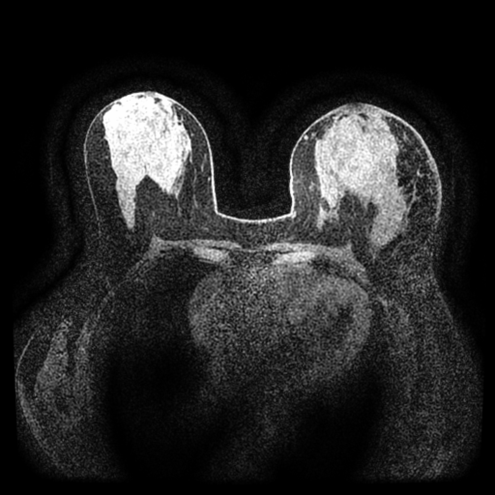

Pre-contrast

🤖

→

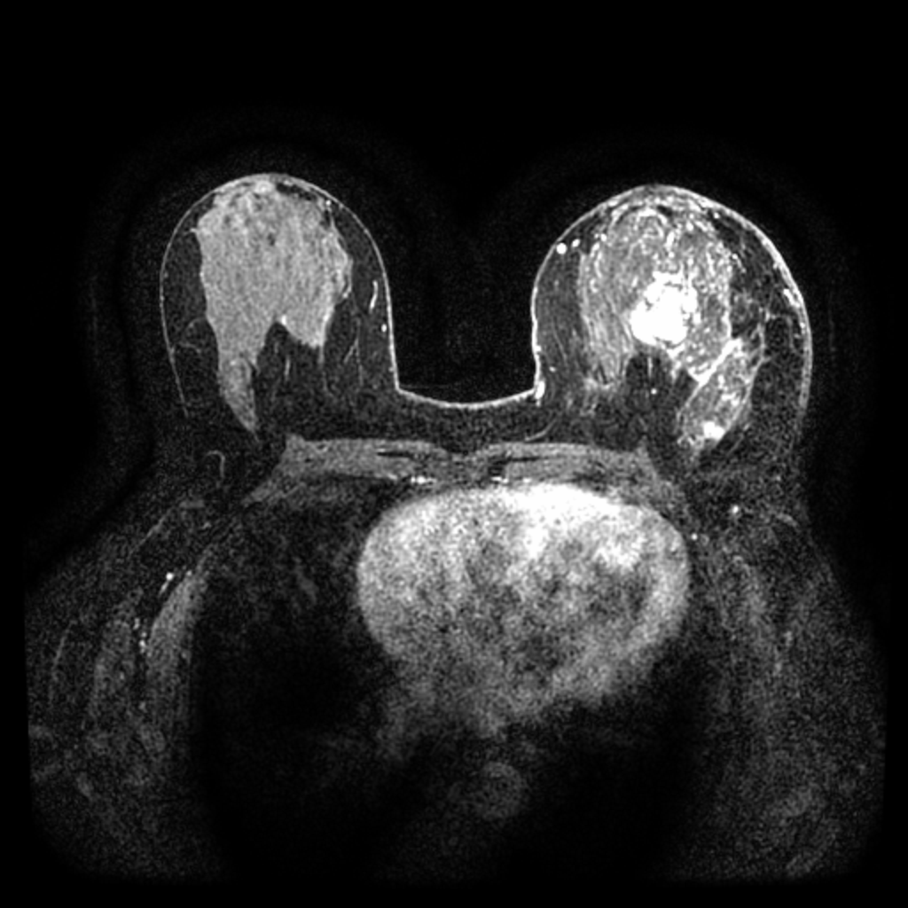

Peak-enhancement

## Data

The challenge utilizes diverse datasets to ensure algorithmic generalizability across different scanners and populations.

### Training Cohort: MAMA-MIA Dataset

This dataset contains pre-treatment DCE-MRI from 1,506 patients from 25 + centers across the United States. Access the complete dataset on [Synapse](https://www.synapse.org/Synapse:syn60868042/wiki/628716). Key properties are shown below:

  

#### Acquisition Plane

Axial
84.4%

Sagittal
15.6%

#### Magnetic Field Strength

1.5T
72.1%

3T
27.9%

#### Scanner Manufacturers

GE
64.1%

Siemens
27.3%

Philips
8.6%

  
  

We note that participants are allowed to train their models on any further dataset, as long as said dataset is publicly available.
To ensure fair evaluation across participating teams, the usage of private data is not allowed in this challenge.
We further note that by participating in this challenge, participants agree to comply with
[EO 14117](https://www.presidency.ucsb.edu/documents/executive-order-14117-preventing-access-americans-bulk-sensitive-personal-data-and-united),
[28 CFR Part 202](https://www.ecfr.gov/current/title-28/chapter-I/part-202), and
[Guide Notice NOT-OD-25-083](https://grants.nih.gov/grants/guide/notice-files/NOT-OD-25-083.html)
and acknowledge that the usage of [NIH Controlled-access Data Repositories (CADRs)](https://grants.nih.gov/policy-and-compliance/policy-topics/sharing-policies/accessing-data/requirements) is prohibited in this challenge.

### Testing Cohorts

The test data were acquired from **two external centers** located in the Netherlands and Argentina. Each test case refers to a 2D slice extracted from a patient’s DCE scan.   
  
For each patient, the slice containing the largest malignant tumor area is selected from the peak enhancement phase.
The peak-enhancement phase is defined as the time point with the highest signal intensity within the tumor region. Note that this conversion to two-dimensional slice requires normalization. The challenge opts for z-score normalization computed with the training dataset pre-contrast mean and standard deviation. The preprocessing scripts can be found on the [MAMA-SYNTH repository](https://github.com/mama-research/mama-synth/tree/master#1%EF%B8%8F%E2%83%A3-preprocessing).   
  
All test images are fat-suppressed and acquired in the axial plane. The main statistics are summarized below:

| Field | Radboud UMC The Netherlands | Instituto Alexander Fleming Argentina |
| --- | --- | --- |
| Number of Cases | 200 | 100 |
| Image Dimension | 416 × 416 px | 512 × 512 px |
| Contrast Agent | DOTAREM (99%), GADOVIST (0.5%) | DOTAREM, GADOVIST |
| Manufacturer | Siemens | GE |
| Magnetic Field Strength | 3T | 1.5T |
| Molecular Subtype | | |
| ↳ Luminal | 165 (85.7 %) | 37 (37 %) |
| ↳ Triple Negative | 23 (9.4 %) | 30 (30 %) |
| ↳ Other | 12 (4.9 %) | 20 (20 %) |

## Evaluation Framework

Submissions are evaluated across four metric groups spanning pixel-level fidelity, perceptual realism, diagnostic classification performance, and segmentation accuracy. Start evaluating your models locally following the instructions on the [MAMA-SYNTH repository](https://github.com/mama-research/mama-synth#2%EF%B8%8F%E2%83%A3-evaluation).

Metric Group 1
Image-to-Image Comparison

Ref
Pred

(a−b)²

Pixel Similarity

### MSE Mean Squared Error

MSE measures the average squared difference between each pixel in the synthesized output and its corresponding pixel in the ground-truth post-contrast image. Lower values indicate greater pixel-level fidelity.

cosine
distance

Deep Features
Similarity

Perceptual Similarity

### LPIPS Learned Perceptual Image Patch Similarity

LPIPS computes perceptual distance between images using deep network feature activations, capturing texture and structural similarity closer to human perception than pixel-wise metrics. Lower values indicate more realistic synthesis.

Metric Group 2
ROI-to-ROI Comparison

Ref
Pred
Luminance
Contrast
Structure

Tumor Texture Similarity

### SSIM Structural Similarity Index

SSIM evaluates image quality by jointly measuring luminance, contrast, and structural similarity within local patches. Applied to the tumor ROI, it captures how well the synthesized enhancement texture matches the reference. Values range from 0–1; higher is better.

FRD
Ref
Pred

Distribution Realism

### FRD Fréchet Radiomics Distance

FRD adapts the FID framework to radiomic feature space, measuring the Fréchet distance between the feature distributions of the synthesized ROI patches and real post-contrast patches. Lower values indicate that the synthesized tumors are more statistically indistinguishable from real enhancement patterns.

Metric Group 3
Downstream Task: Classification

AUC
FPR
TPR

P

O

Binary Classification

### AUROC Pre vs. Post

Measures the classifier's ability to distinguish between **pre and post-contrast** on synthesized images. A score of 1.0 indicates perfect separation; 0.5 is random.

AUC
FPR
TPR

T

O

Binary Classification

### AUROC Tumor Vs. Non-Tumor

Measures the classifier's ability to distinguish between **tumor and non-tumor tissue** on synthesized images. A score of 1.0 indicates perfect separation; 0.5 is random.

Metric Group 4
Downstream Task: Segmentation

∩
Ref
Pred
Overlap

Overlap Accuracy

### DICE Sørensen–Dice Coefficient

The Dice coefficient measures voxel-level overlap between the predicted segmentation mask on synthesized post-contrast and the ground-truth mask. It is the harmonic mean of precision and recall over the segmented region. Values range from 0–1; higher values indicate better spatial overlap.

max boundary deviation

Boundary Accuracy

### Hausdorff Distance 95th Percentile

The 95th-percentile Hausdorff Distance (HD95) measures the worst-case boundary deviation between the predicted segmentation mask on synthesized post-contrast and reference segmentation contours, excluding the top 5% of outlier distances for robustness. Lower values indicate more precise boundary delineation.

Ranking Scheme

RANKING LOGIC

METRIC GROUP 1
Image

METRIC GROUP 2
ROI

METRIC GROUP 3
Classification

METRIC GROUP 4
Segmentation

MSE (1.1)

SSIM (2.1)

AUROC (3.1)

DICE (4.1)

LPIPS (1.2)

FRD (2.2)

AUROC (3.2)

Hausdorff (4.2)

Avg Rank 1

Avg Rank 2

Avg Rank 3

Avg Rank 4

Final Ranking
Average of task ranks

## Timeline

|  |  |  |
| --- | --- | --- |
| May 8 | Validation Phase Opens |  |
|  | | |
| June 25 | Test Phase Opens |  |
|  | | |
| July 10 | Last Submission Deadline |  |
|  | | |
| August 1 | Official Results Release |  |
|  | | |
| September 27 | Winners Announcement at Deep-Breath Workshop (MICCAI 2026) |  |

## Awards

🥈

2nd

€250

2

🥇

1st

€500

1

🥉

3rd

€150

3

Best Paper Award
€300

Exceptional scientific quality · Methodological novelty · Independent of leaderboard ranking

Papers submitted to the [Deep Breath Workshop](https://deep-breath-miccai.github.io/deepbreath-2026/) are eligible.

## Organization Committee

#### Richard Osuala

Universitat de Barcelona, Spain

Challenge Co-Lead

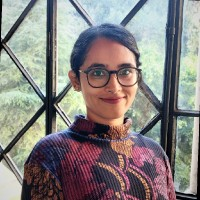

#### Smriti Joshi

Universitat de Barcelona, Spain

Challenge Co-Lead

#### Jarek van Dijk

Radboud University Medical Centre, Netherlands

Challenge Co-Lead

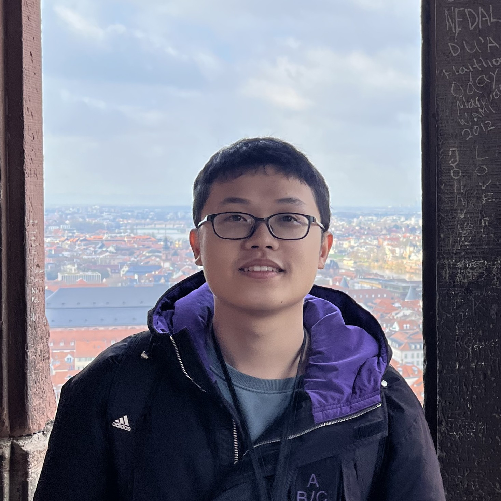

#### Luyi Han

Radboud University Medical Centre, Netherlands

#### Lidia Garrucho

Universitat de Barcelona, Spain

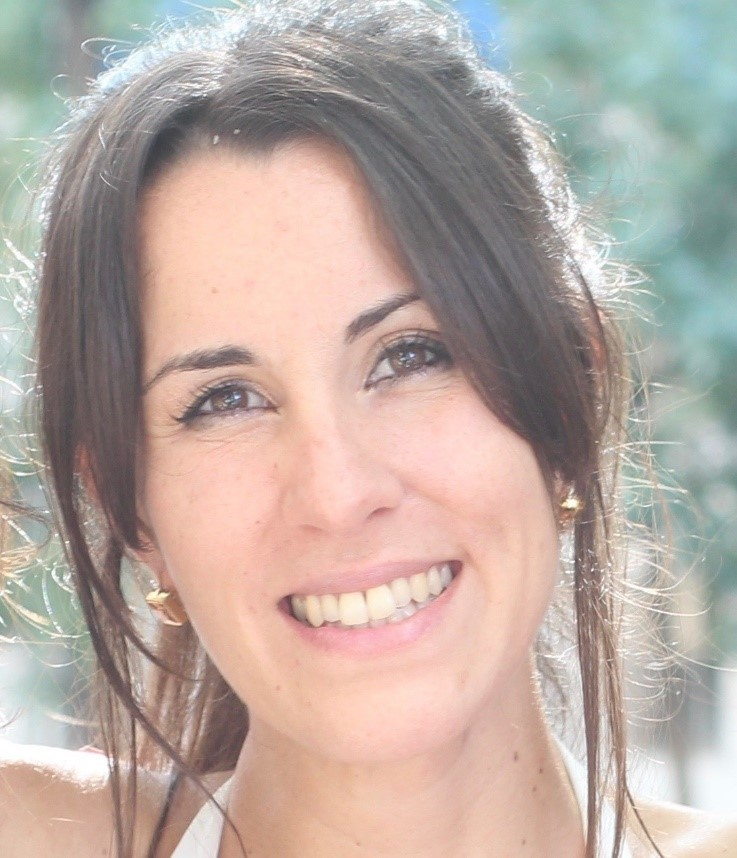

#### Maria Laura Cosaka

Instituto Alexander Fleming, Argentina

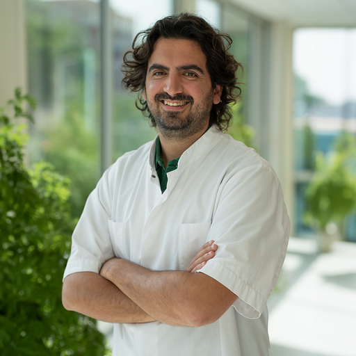

#### Antonio Portaluri

The Netherlands Cancer Institute (NKI), Netherlands

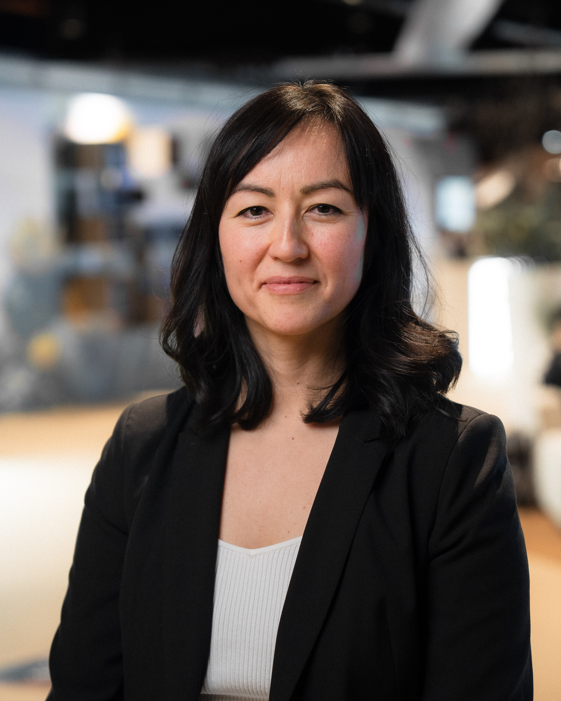

#### Jamilia Arykbaeva

Universitat de Barcelona, Spain

#### Oliver Diaz

Universitat de Barcelona & CVC, Spain

## Advisory Committee

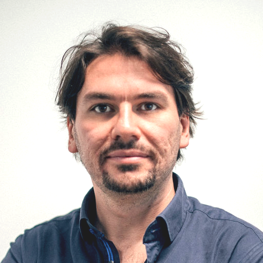

#### Simone Balocco

Universitat de Barcelona & CVC, Spain

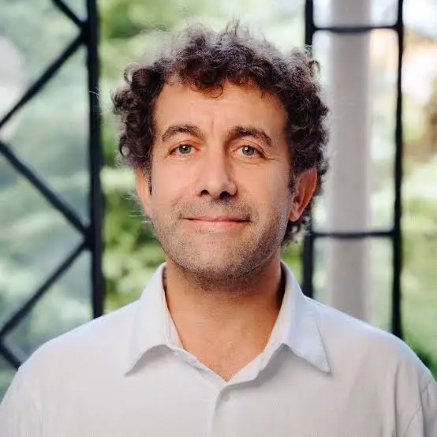

#### Karim Lekadir

Universitat de Barcelona & ICREA, Spain

#### Yaofei Duan

Radboud University Medical Centre, Netherlands

#### Tianyu Zhang

Radboud University Medical Centre, Netherlands

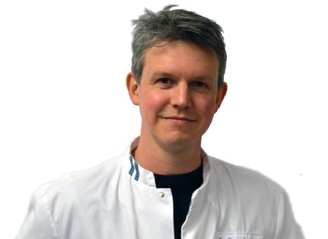

#### Ritse Mann

Radboud University Medical Centre, Netherlands

#### Daniel Mysler

Instituto Alexander Fleming, Argentina

## Contact

For Q&A regarding challenge, please directly refer to [Grand Challenge Forum](https://mamasynth.grand-challenge.org/forum/topics/). For additional inquiries about the MAMA-SYNTH challenge and future collaborations, feel free to reach out to Smriti Joshi ([smriti.joshi[at]ub.edu](mailto:smriti.joshi@ub.edu)) and Richard Osuala ([richard.osuala[at]gmail.com](mailto:richard.osuala@gmail.com)).
.

## Partners & Institutions

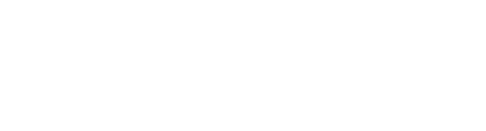
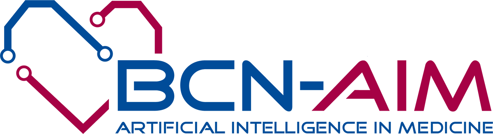

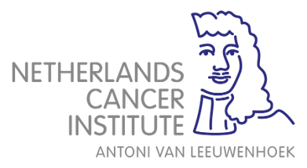

